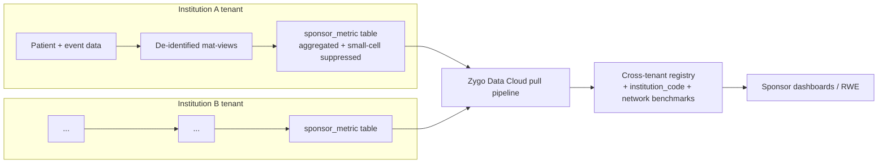
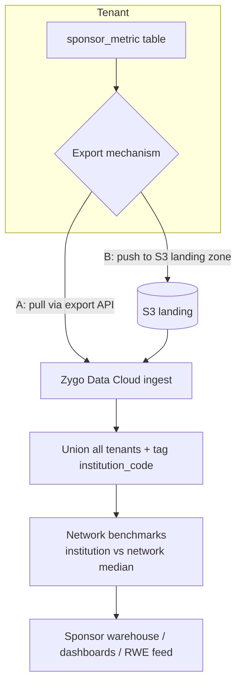

# ProstaCare — Cross-Tenant Data Aggregation Spec (Sponsor / Zygo Data Cloud)

**Purpose:** define how **de-identified summary data** from each institution tenant is aggregated across institutions for the **sponsor** (project funder — inferred **Novartis/NVS**, to confirm), via **Zygo Data Cloud**. This closes gap **G3** in `NOVAEDGE_ALIGNMENT_REVIEW.md` (cross-institution reporting is not native because tenant = institution) and is the surface referenced in `PROSTACARE_BUILD_SPEC_V1.md §10`.

**Golden rule:** **only de-identified aggregates ever leave a tenant.** No `patient_code`, no PHI, no free text, no exact dates, no small cells. The sponsor reads **Zygo Data Cloud only** — never a tenant.

---

## 1. Architecture — the two-hop model

- **Hop 1 — in-tenant aggregation (inside each institution):** a scheduled workflow rolls the de-identified mat-views into a single **`sponsor_metric`** table, applies **small-cell suppression**, and stamps the tenant's anonymised `institution_code`. Data stays in the tenant.
- **Hop 2 — Zygo Data Cloud pull:** Data Cloud pulls each tenant's `sponsor_metric` on a cadence, **unions** them, computes **network-level benchmarks** (this institution vs the network), and serves the sponsor. Tenants remain isolated; only the aggregate table is exported.

**Why in-tenant first:** it keeps the privacy boundary and suppression logic *inside* the tenant (governed, auditable), so nothing leaves until it is already de-identified and suppressed. Data Cloud only ever sees safe aggregates.

---

## 2. The in-tenant aggregate table — `sponsor_metric`

One long-format fact table per tenant (easy to export, flexible to extend):

| Column | Meaning | Example |
|---|---|---|
| `institution_code` | Anonymised institution id (governed) | `INST-017` |
| `period_month` | Month bucket (never exact dates) | `2026-06` |
| `metric_key` | The measure | `arsi_intensification_rate` |
| `dim1_name` / `dim1_value` | Optional breakdown dimension | `risk_group` / `High` |
| `dim2_name` / `dim2_value` | Optional 2nd dimension | `coverage` / `CGHS` |
| `numerator` | Count meeting the measure | `18` |
| `denominator` | Eligible population | `62` |
| `patient_n` | Distinct patients in the cell | `62` |
| `suppressed` | TRUE if `patient_n` < threshold → num/den nulled | `false` |
| `computed_at` | Aggregation run timestamp | `2026-06-30` |

**Small-cell suppression:** if `patient_n < THRESHOLD` (default **11**, configurable by governance), `numerator`/`denominator` are set null and `suppressed = true`. Prevents re-identification from thin cells. Applied **in-tenant**, before export.

**Encoding on NOVA Edge:** `sponsor_metric` is a normal entity; a scheduled workflow (`policies` cron, e.g. nightly) runs `sql_exec INSERT … SELECT … FROM <de-identified mat-views> …` with the suppression `CASE`. It reads only the RLS-scoped, de-identified views — never patient rows.

---

## 3. The data contract — what MAY be aggregated (and what may not)

### 3.1 Allowed measures (`metric_key` catalogue)
All are counts/rates over month buckets, de-identified, suppressible.

| Family | Example metric_keys | Dimensions allowed |
|---|---|---|
| **Cohort volume** | `patient_count`, `new_registrations` | risk_group, coverage, state, age_band |
| **Risk & staging** | `risk_mix`, `stage_at_presentation`, `staging_completeness_rate` | risk_group, stage_group |
| **Care gaps** | `open_gap_count`, `gap_rate` (by type: bone_scan/psma/bone_protection/dexa/genomics/arsi/followup/psychosocial) | gap_type, risk_group |
| **Benchmarks** | `arsi_intensification_rate`, `psma_completion_rate`, `bone_protection_rate`, `mdt_review_rate` | risk_group |
| **Treatment uptake** | `adt_rate`, `rt_completed_rate`, `arsi_rate`, `active_surveillance_rate` | risk_group, coverage |
| **Access** | `cghs_delay_days_dist`, `time_to_treatment_days_dist` | coverage |
| **Outcomes** | `psa_lt_0_2_at_12m_rate`, `bcr_at_24m_rate`, `crpc_progression_at_36m_rate` | risk_group, treatment_group |
| **Protocol** | `protocol_adherence_score` | — |
| **Demographics** | `coverage_mix`, `referral_source_mix`, `geography_mix` | — |

### 3.2 Never exported (hard exclusions)
- `patient_code` or any identifier; any `patient_identity` field (name/ABHA/Aadhaar/phone).
- Free text: `safety_side_effects`, `context_remarks`, journey/discussion notes, documents.
- **Exact dates** — only `period_month` buckets leave the tenant.
- Any cell with `patient_n < THRESHOLD` (suppressed).
- Row-level patient records of any kind — **only aggregates**.

### 3.3 Governance
The `metric_key` catalogue (§3.1) is the **approved contract**: an independent clinical + DPO sign-off defines it; the sponsor receives only what is in it. Changes are versioned. Suppression threshold and `institution_code` naming (anonymised vs named) are governance decisions (§6).

---

## 4. Zygo Data Cloud — the pull pipeline (Hop 2)

- **Export mechanism (decision `O-AGG3`):**
  - **A — pull:** Data Cloud calls a per-tenant **export endpoint** (reports/SQL over `sponsor_metric`) on a schedule.
  - **B — push:** each tenant writes `sponsor_metric` to a **secure S3 landing zone** (per-tenant prefix) that Data Cloud ingests. *(Recommended — simplest, one-directional, auditable; reuses the AWS/S3 setup already in place.)*
- **Cadence (`O-AGG4`):** in-tenant compute nightly; Data Cloud pull **weekly or monthly** (sponsor reporting cadence).
- **Cross-tenant build:** Data Cloud unions tenant extracts, attaches `institution_code` + region, computes **network benchmarks** (each institution vs network median), and publishes the sponsor dataset. Data Cloud is the *only* place cross-institution data exists.

---

## 5. Privacy & compliance controls (summary)

| Control | Where | Rule |
|---|---|---|
| De-identification | in-tenant | only aggregates; no PHI/identifiers ever in `sponsor_metric` |
| Small-cell suppression | in-tenant | `patient_n < THRESHOLD` → nulled + `suppressed=true` |
| Date generalisation | in-tenant | month buckets only |
| Institution anonymisation | in-tenant / Data Cloud | `institution_code`, not hospital name (unless governance permits) |
| Contract enforcement | governance | sponsor gets only the approved `metric_key` catalogue |
| One-directional flow | pipeline | tenant → Data Cloud → sponsor; sponsor never touches a tenant |
| Audit | both hops | every aggregation run + every export logged |
| Data residency | both | **AWS Mumbai `ap-south-1`** (DPDP compliant); THB-provided infrastructure |

---

## 6. Open decisions (`O-AGG`)
1. **`O-AGG1` metric catalogue** — confirm/extend §3.1; sign-off owner (clinical + DPO).
2. **`O-AGG2` suppression threshold** — default 11; confirm.
3. **`O-AGG3` export mechanism** — S3 push (recommended) vs pull API.
4. **`O-AGG4` cadence** — nightly compute; weekly/monthly export.
5. **`O-AGG5` institution identity** — anonymised `institution_code` vs named; who holds the code map.
6. **`O-AGG6` sponsor confirmation** — confirm NVS = Novartis and the exact reporting deliverables (dashboards vs raw RWE feed).
7. **`O-AGG7` consent/legal basis** — for aggregate secondary use (DPDP; ethics committee if applicable).

---

## 7. Build tasks
- In-tenant: `sponsor_metric` entity + nightly aggregation workflow (reads de-identified mat-views, applies suppression, stamps `institution_code`).
- Export: S3 landing writer (per-tenant prefix) **or** export endpoint.
- Zygo Data Cloud: ingest + union + institution tagging + network-benchmark model + sponsor dashboards.
- Governance: version the metric catalogue + suppression config; audit both hops.

---

*Companion: `NOVAEDGE_ALIGNMENT_REVIEW.md` (G3), `PROSTACARE_BUILD_SPEC_V1.md §10`, `TENANT_ONBOARDING_PLAN.md` (provisions the in-tenant aggregation as part of the preset).*
