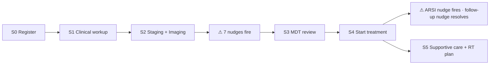
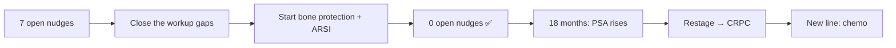

# ProstaCare — Complete Patient Data Walkthrough (worked example)

**Purpose:** show, stage by stage with real values, exactly **what a clinician enters**, **what records the system creates**, **which nudges fire or resolve**, and **what is derived**. Two journeys: a **new patient** (onboarding) and an **existing patient** (follow-up → response → progression). Ends with the **complete record summary**, the **derived layer**, and **fill-in examples** so the clinical team can answer the remaining open questions.

**Notation:** `1:1` = one row per patient · `1:N` = a dated log (append-only) · **derived** = computed, never typed.
All field keys and values come from the workbook `Field_Dictionary` / `Value_Lists`.

---

# PART A — NEW PATIENT ONBOARDING

**Meet `PCR-005`** — 66-year-old man, referred from a government OPD in Uttar Pradesh, PMJAY coverage, newly diagnosed.



---

## Stage 0 — Registration ("Add New Patient")

**Screen:** *Add New Patient* → Demographics form.

| Field entered | Value |
|---|---|
| `patient_code` | **PCR-005** |
| `registry_enrolment_date` | 2026-07-09 |
| `age_at_diagnosis_years` | 66 |
| `diagnosis_date` | 2026-06-28 |
| `language_preference` | Hindi |
| `healthcare_coverage` | PMJAY (Ayushman Bharat) |
| `referring_hospital_centre` | Government General Hospital |
| `referral_source` | Government Hospital / OPD |
| `state` | Uttar Pradesh |
| `travel_distance_km` | 180 |
| `primary_clinician_id` | Dr. A. Sharma (the logged-in user) |

**Records created**
```
patient (1:1)                → 1 row   [PCR-005]
pathology (1:1 shell)        → 1 empty row
treatment_plan (1:1 shell)   → 1 empty row
outcome (1:1 shell)          → 1 empty row
audit_event                  → "patient.created"
notification → MDT           → "New patient registered — PCR-005" (email via SES)
```
**Derived immediately:** cohort count +1 · `new_registrations` for 2026-07 +1.
**Nudges:** none yet (no clinical data to evaluate).

---

## Stage 1 — Clinical workup (complaint, DRE, biopsy, PSA)

**Screen:** *Clinical Assessment*.

**1a. Presenting complaint & DRE** → written to **`pathology` (1:1)**

| Field | Value |
|---|---|
| `primary_complaint` | LUTS (Lower urinary tract symptoms) |
| `duration` | 6 months |
| `ipss_score` | 20–35 (Severe) |
| `bowel_rectal_symptoms` | None |
| `dre_findings` | Nodule – bilateral |
| `prostate_volume_cc` | 54 |

**1b. PSA history** → each entry appends a **`psa_reading` (1:N dated)** row

| `psa_date` | `psa_ng_ml` | `free_psa_pct` | `psa_density` |
|---|---|---|---|
| 2026-05-10 | 28.4 | 8 | 0.53 |
| 2026-06-20 | 34.1 | 7 | 0.63 |

**1c. Biopsy** → written to **`pathology` (same 1:1 row)**

| Field | Value |
|---|---|
| `biopsy_date` | 2026-07-01 |
| `biopsy_type` | MRI-targeted / Fusion biopsy |
| `pi_rads_score` | PI-RADS 5 |
| `gleason_score` | 4+5=9 |
| `isup_grade_group` | Grade 5 (≥4+5) |
| `cores_positive_total` | 9 / 12 |
| `core_involvement_pct` | 71 |
| `perineural_invasion` | Present |
| `ece_extracapsular_extension` | Present (radiological) |

**1d. Comorbidities & family history** → **boolean flags on `pathology`**
`comorbidity_1` (T2 Diabetes) = **Yes** · `comorbidity_2` (Hypertension) = **Yes** · others No
`family_history_2` (Breast Ca) = **Yes** · others No

---

## Stage 2 — Staging & imaging (the moment nudges wake up)

**2a. TNM & risk** → appends **`staging_assessment` (1:N dated)** — *row #1*

| Field | Value |
|---|---|
| `assessed_on` | 2026-07-05 |
| `clinical_t_stage` | cT3b |
| `n_stage` | cN1 |
| `m_stage` | cM0 |
| `eau_risk_category` | **Very High / Locally Advanced** |
| `ecog_performance_status` | 1 – Restricted strenuous activity |
| `castration_status` | **Not on ADT** *(pre-treatment)* |

**2b. Imaging & molecular** → appends **`imaging_study` (1:N dated)** rows — **only for studies actually performed**

| `study_date` | `modality` | `result` |
|---|---|---|
| 2026-06-25 | `mpmri_pelvis` | Done — abnormal |
| 2026-06-26 | `ct_abdomen_pelvis` | Done — lymphadenopathy |

> **Important:** "Not done" is **the absence of a row**, not a row with an empty date.
> `bone_scan_spect`, `psma_pet_ct`, `dexa_bone_density`, `germline_somatic_testing` have **no rows yet** → the engine reads them as `Not done`:
> `imaging_status(m) = latest imaging_study row for modality m, else "Not done"`

### ⚠ The care-gap engine runs (on save). Current state → 8 rules:

```
current_risk       = Very High / Locally Advanced      (staging row #1)
current_castration = Not on ADT                        (staging row #1)
bone_scan = Not done · psma = Not done · dexa = Not done · germline = Not done
bone_protection = Not started (no supportive-care row yet)
next_follow_up_psa_date = (empty) · phq9 = Not done

1 bone_scan_missing       Not done AND risk∈{High,VeryHigh,M1}   → FIRES  🔴 Urgent
2 psma_missing            Not done AND risk∈{High,VeryHigh}      → FIRES  🔴 Urgent
3 bone_protection_missing Not started                            → FIRES  🔴 Urgent
4 dexa_missing            Not done                               → FIRES  🟠 Warning
5 genomics_missing        Not done                               → FIRES  🟠 Warning
6 arsi_readiness          castration ≠ HSPC                      → does NOT fire ✅
7 followup_psa_missing    date empty                             → FIRES  🔵 Info
8 psychosocial_prompt     phq9 = Not done                        → FIRES  🔵 Info
```
**Result: 7 open nudges** — 3 Urgent · 2 Warning · 2 Info.
**Records created:** 7 × `nudge` + 7 × `nudge_event(opened)`.
**Banner:** *"Urgent: 3 actions require immediate attention."* · **Primary focus:** "Complete bone scan / SPECT".

> **Note rule 6 gating:** ARSI does not fire yet because the patient is not on ADT. It will fire the moment castration status becomes HSPC (Stage 4). This is why staging is a **dated log**, not a cell.

---

## Stage 3 — MDT review

**Screen:** *Treatment Plan → Intent & MDT* → **`treatment_plan` (1:1)**

| Field | Value |
|---|---|
| `treatment_intent` | Disease control (locally advanced) |
| `mdt_tumour_board_status` | Reviewed — plan agreed |
| `date_of_mdt_review` | 2026-07-08 |
| `clinical_trial_eligibility` | Not screened |
| `treatment_start_date` | 2026-07-10 |

**Derived:** `mdt_review_rate` numerator +1 · `time_to_treatment = 2026-07-10 − 2026-06-28 = 12 days`.

---

## Stage 4 — Treatment starts (and the ARSI nudge wakes)

**4a. Therapy** → appends **`treatment_line` (1:N dated)** rows

| # | `line_type` | `agent` / `formulation_dose` | `start_date` | `status` |
|---|---|---|---|---|
| 1 | ADT | LHRH Agonist (Leuprolide / Lupride) · Leuprolide 45 mg depot (6-monthly) | 2026-07-10 | Active |
| 2 | Anti-androgen | Bicalutamide 50 mg OD (flare cover) | 2026-07-10 | Active (ends 2026-08-07) |

**4b. Castration status changes** → appends **`staging_assessment` — row #2** *(never overwrites row #1)*

| `assessed_on` | `eau_risk_category` | `castration_status` |
|---|---|---|
| 2026-07-10 | Very High / Locally Advanced | **Hormone-sensitive (HSPC)** |

**4c. Supportive care** → appends **`supportive_care_event` (1:N dated)** — row #1

| Field | Value |
|---|---|
| `bone_protection_therapy` | **Not started** |
| `calcium_vitamin_d` | Not prescribed |
| `next_follow_up_psa_date` | **2026-10-10** |
| `testosterone_monitoring` | Not checked this cycle |
| `psychosocial_screening_phq9` | Not done |
| `nutritional_assessment` | Not done |

### ⚠ Engine re-runs — two nudges change state
```
current_castration = Hormone-sensitive (HSPC)     ← from staging row #2
next_follow_up_psa_date = 2026-10-10              ← from supportive row #1

6 arsi_readiness   HSPC AND risk⊇High AND arsi=Not initiated → FIRES 🟠 Warning  (NEW)
7 followup_psa_missing   date now present                    → AUTO-RESOLVES ✅
```
**Result: 7 open nudges** — 3 Urgent · 3 Warning · 1 Info.
`nudge_event(opened)` for ARSI · `nudge_event(resolved)` for follow-up. **Nobody clicked "resolve"** — the data did it.

---

## Stage 5 — RT plan + journey events

**RT** → appends **`treatment_line`** row #3

| Field | Value |
|---|---|
| `line_type` | RT |
| `rt_indication` | Definitive RT (prostate ± LN) |
| `rt_status` | Planned |
| `rt_modality` | IMRT / VMAT |
| `target_volume` | Prostate + Whole Pelvis |
| `dose_fractionation` | 78 Gy / 39 fx (conventional) |
| `rt_facility` | Govt. Regional Cancer Centre |
| `planned_rt_start_date` | 2026-09-01 |
| `cghs_preauth_status` | Not required *(PMJAY, not CGHS)* |

**Journey events** → **`journey_event` (1:N dated)**
`Outpatient Visit` 2026-06-28 · `Lab / PSA` 2026-05-10 · `Imaging` 2026-06-25 · `Biopsy / Procedure` 2026-07-01 · `MDT Review` 2026-07-08 · `Treatment Initiation` 2026-07-10

---

# PART B — EXISTING PATIENT (follow-up → response → progression)

**Meet `PCR-001`** — the workbook's case: 68 y, High risk, HSPC, CGHS, on ADT with **7 open nudges** at the start.



## B1 — Closing the gaps (each append auto-resolves a nudge)

| Date | Clinician action | Row appended | Nudge effect |
|---|---|---|---|
| 2026-08-15 | Bone scan performed | `imaging_study` (Bone Scan, *Done — no metastases*) | 🔴 `bone_scan_missing` → **resolved** |
| 2026-08-20 | PSMA PET-CT performed | `imaging_study` (PSMA, *Done — pelvic nodal uptake*) | 🔴 `psma_missing` → **resolved** |
| 2026-09-01 | Bone protection started | `supportive_care_event` (Zoledronic acid 4 mg IV q3m; Calcium+VitD prescribed) | 🔴 `bone_protection_missing` → **resolved** |
| 2026-09-05 | DEXA done | `imaging_study` (DEXA, *Osteopenia (T −1 to −2.5)*) | 🟠 `dexa_missing` → **resolved** |
| 2026-09-08 | Germline result | `imaging_study` (Germline, *BRCA1/2 — negative*) | 🟠 `genomics_missing` → **resolved** |
| 2026-09-10 | ARSI initiated | `treatment_line` (ARSI · Abiraterone + Prednisone) | 🟠 `arsi_readiness` → **resolved** |
| 2026-09-12 | PHQ-9 completed | `supportive_care_event` (PHQ-9 *Minimal (0–4)*) | 🔵 `psychosocial_prompt` → **resolved** |

**Open nudges: 7 → 0.** Every closure is a `nudge_event(resolved)`; nothing was manually dismissed.
*(This is why there is no "dismiss" button — see `SIMPLIFICATION_REVIEW.md`.)*

## B2 — Response, then progression (append-only shows the whole arc)

**PSA log (`psa_reading`, 1:N):**
| Date | PSA | Meaning |
|---|---|---|
| 2026-08-01 | 42.6 | baseline |
| 2026-11-01 | 4.2 | responding |
| 2027-02-01 | **0.6** | **nadir** |
| 2027-11-01 | 3.4 | rising |
| 2028-01-10 | 8.1 | rising on castrate testosterone |

**Restaging** → `staging_assessment` **row #3** (rows #1 and #2 untouched)
| `assessed_on` | `eau_risk_category` | `castration_status` |
|---|---|---|
| 2028-01-15 | `M1 – Metastatic HSPC` *(see note)* | **Castration-resistant (CRPC)** |

> ⚠️ **Enum limitation for the clinical team (E3):** the `eauRiskCategory` list has only `M1 – Metastatic HSPC` — there is **no `M1 – CRPC` value**. So a metastatic patient who becomes castration-resistant carries a risk label that still says "HSPC", while `castration_status` correctly says CRPC. **Should we add `M1 – Metastatic CRPC` to the risk enum, or is castration_status alone sufficient?**

**New line** → `treatment_line` row #4: `chemo` · Docetaxel 75 mg/m² q3w · start 2028-02-01

**Outcome (1:1) updated:**
`psa_nadir_value` 0.6 · `psa_nadir_date` 2027-02-01 · `psa_doubling_time_months` 4.8 ·
`biochemical_recurrence_status` Biochemical recurrence · `crpc_progression_status` **Progressed to CRPC** · `crpc_progression_date` 2028-01-15

**Engine effect:** `arsi_readiness` **cannot re-fire** (castration ≠ HSPC). The HSPC→CRPC transition is preserved as a **dated fact**, which is exactly why staging is a log.

## B3 — Completing the record (the fields the first pass skipped)

These close every remaining gap against the Field Dictionary. `PCR-001` is **CGHS**, so the pre-auth flow applies.

**CGHS pre-auth for RT** → updates the RT `treatment_line`
| Field | Value |
|---|---|
| `cghs_preauth_status` | Not initiated → **Pending** → **Approved** |
| `cghs_request_date` | 2026-09-20 |
| `cghs_approval_date` | 2026-11-06 |
→ **derived** `cghs_delay = 47 days` (feeds the access-delay chart)

**RT delivered & assessed** → RT `treatment_line` + `outcome`
| Field | Value |
|---|---|
| `rt_status` | Completed |
| `rt_completion_date` | 2027-01-20 |
| `rt_outcome_status` | Complete biochemical response |

**Testosterone & toxicity** → `supportive_care_event` + `treatment_line`
| Field | Value |
|---|---|
| `testosterone_level` | 18 ng/dL |
| `testosterone_monitoring` | Castrate confirmed (<50 ng/dL) |
| `safety_side_effects` | Grade 1 fatigue; hot flushes — no dose change |

**Chemotherapy detail** (the 2028 line) → `treatment_line` (`line_type` = chemo)
| Field | Value |
|---|---|
| `chemotherapy_regimen` | Docetaxel 75 mg/m² q3w |
| `number_of_cycles_completed` | 6 |
| `last_cycle_date` | 2028-06-12 |

**Follow-up & recurrence** → `outcome` (1:1)
| Field | Value |
|---|---|
| `last_follow_up_date` | 2028-06-20 |
| `best_response` | Biochemical recurrence |
| `biochemical_recurrence_date` | 2027-11-01 |

> `last_follow_up_date` + `next_follow_up_psa_date` are what drive the **Patient List** segments (Last Visit / Upcoming / Missed-Overdue) — which is why we need **no Encounter entity**.

**PSA remarks** → `psa_reading.context_remarks` — e.g. *"post-RT, on ADT + abiraterone"*
**Journey events** → `journey_event` (`event_type`, `event_date`, `event_notes`) — e.g. `Adverse Event` · 2028-03-04 · *"Grade 2 neutropenia, cycle delayed 1 week"*
**Rx upload** → `document` — `rx_upload` accepts PDF/image; stored with uploader + timestamp, audited.

---

# PART C — THE COMPLETE RECORD (what we hold on `PCR-001`)

| Model | Card. | Rows | What it holds |
|---|---|---|---|
| `patient` | 1:1 | 1 | code, age@dx, coverage, geography, referral, enrolment, dx date, primary clinician |
| `pathology` | 1:1 | 1 | complaint, IPSS, DRE, volume, biopsy, PI-RADS, Gleason, ISUP, cores, PNI, ECE + 15 comorbidity/family flags |
| `treatment_plan` | 1:1 | 1 | intent, MDT status + date, trial eligibility, treatment start |
| `outcome` | 1:1 | 1 | best response, nadir + date, PSADT, BCR status/date, CRPC status/date, RT outcome |
| `psa_reading` | 1:N | **5** | dated PSA, free %, density, remarks |
| `staging_assessment` | 1:N | **3** | dated cTNM, EAU risk, ECOG, castration status |
| `imaging_study` | 1:N | **6** | dated mpMRI, bone scan, PSMA, CT, DEXA, germline |
| `treatment_line` | 1:N | **4** | ADT · anti-androgen · ARSI · chemo (+RT fields when line_type = RT) |
| `supportive_care_event` | 1:N | **3** | dated bone protection, Ca/VitD, follow-up PSA date, testosterone, PHQ-9, nutrition |
| `journey_event` | 1:N | **9** | the milestone narrative |
| `nudge` | 1:N | **7** | all resolved |
| `nudge_event` | 1:N | **~21** | opened / acknowledged / resolved |
| `notification` / `discussion_entry` | 1:N | 3 | MDT messages + trail |
| `document` | 1:N | 2 | Rx uploads |
| `audit_event` | 1:N | many | every create / edit / unlock / notify |

---

# PART D — DERIVED DATA & LOGIC OUTPUTS (never typed)

## D1 — Current state (latest dated row per log)
```
current_risk        = M1                        ← staging row #3 (2028-01-15)
current_castration  = Castration-resistant      ← staging row #3
current_line        = chemo (Docetaxel)         ← treatment_line row #4
latest_psa          = 8.1 ng/mL (2028-01-10)    ← psa_reading latest
bone_protection     = Zoledronic acid 4 mg q3m  ← supportive_care latest
```
→ drives the **header badges** and the **rule inputs**.

## D2 — Per-patient derived values
| Derived | Formula | Value |
|---|---|---|
| ADT duration | `today − ADT start` | 19 months |
| Time to treatment | `treatment_start − diagnosis_date` | 12 days *(PCR-005)* |
| PSA nadir / PSADT | from `psa_reading` + `outcome` | 0.6 @ 2027-02 · 4.8 mo |
| Open gap counts | `COUNT(nudge WHERE status=open GROUP BY severity)` | 0 / 0 / 0 |
| Record completeness | % required fields present per field group | 94% |

## D3 — Cohort roll-up (this patient's contribution)
| Cohort metric | How PCR-001 contributes |
|---|---|
| `psma_completion_rate` | numerator **+1**, denominator +1 (high-risk) |
| `bone_protection_rate` | numerator **+1**, denominator +1 (on ADT) |
| `arsi_intensification_rate` | numerator **+1**, denominator +1 (HSPC high-risk at the time) |
| `mdt_review_rate` | numerator +1 |
| `open_gap_count` | **0** (was 7) |
| `protocol_adherence_score` | pulls the cohort score **up** |

## D4 — What leaves the tenant (sponsor)
Only the de-identified aggregate row, small-cell suppressed:
```
institution_code = INST-017 | period_month = 2026-09 | metric_key = bone_protection_rate
dim1 = risk_group/High     | numerator = 18 | denominator = 62 | patient_n = 62 | suppressed = false
```
❌ Never: `patient_code`, names, exact dates, free text, or any cell with `patient_n < 11`.

---

# PART E — OPEN QUESTIONS, MADE ANSWERABLE (examples for the clinical team)

## E1 — Enum localisation per site *(the concrete ask)*
The workbook ships **national default lists**. Each institution may need local values. Please fill in for the launch site:

**RT Facility** — default list: *AIIMS New Delhi · Tata Memorial Centre · RGCI Delhi · Max Cancer Centre · Fortis · Govt. Regional Cancer Centre*
| Your site's RT facilities (add/remove) |
|---|
| e.g. `SGPGI Lucknow — LINAC 1 (VMAT)` |
| e.g. `SGPGI Lucknow — LINAC 2 (IMRT)` |
| e.g. `Kalyan Singh Super Speciality Cancer Institute` |
| ☐ *Or: keep the national list as-is* |

**Referring Hospital / Centre** — default: *AIIMS New Delhi · Tata Memorial · CMC Vellore · PGIMER · RGCI · SGPGI · Government General Hospital · Private Urologist / Clinic*
| Your site's real referrers |
|---|
| e.g. `District Hospital, Barabanki` · `District Hospital, Sitapur` |
| e.g. `Balrampur Hospital, Lucknow` |
| ☐ *Or: keep the national list* |

**Healthcare Coverage** — the national schemes are fixed (PMJAY · CGHS · ESIC · Private · Self-pay), but the **State Scheme** name varies:
| State | State-scheme name to display |
|---|---|
| Andhra Pradesh / Telangana | Aarogyasri |
| Maharashtra | Mahatma Jyotiba Phule Jan Arogya Yojana |
| Tamil Nadu | CM's Comprehensive Health Insurance Scheme |
| Rajasthan | Chiranjeevi / Rajya Bima |
| **Your state** | ______________________ |

**Language preference** — trim the national list to what your site actually needs (e.g. UP site: Hindi, English, Urdu).
**ADT formulations** — confirm locally stocked brands/doses (e.g. add `Triptorelin 22.5 mg (6-monthly)` if used).

## E2 — Record lock durations *(B3b)*
Pick the scenario that matches your clinic:
| Scenario | Suggested `EDIT_WINDOW` |
|---|---|
| Data entered **live in clinic**, corrected same session | **24 h** |
| Entered by the clinician **later the same day / next morning** | **48 h** *(our default)* |
| Batched entry by a registrar **within the week** | **72 h – 7 days** |

And: **HOD unlock window** 24 h — enough to fix and re-save? Should a **Coordinator** also unlock? ☐ Yes ☐ No

## E3 — Care-gap rule tuning *(B8)*
For each rule, confirm or amend:
| Rule | Current condition | Amend to…? |
|---|---|---|
| `bone_scan_missing` | risk ∈ {High, Very High, M1} | e.g. also Intermediate-Unfavourable? |
| `psma_missing` | risk ∈ {High, Very High} | e.g. include M1? |
| `bone_protection_missing` | `= Not started` | should it fire **only if ADT ≥ 3 months**? |
| `dexa_missing` | `= Not done` | only when on ADT? |
| `arsi_readiness` | HSPC + High + not initiated | include Very High / M1? |
| Benchmarks | ARSI 60% · PSMA 85% · Bone 85% · MDT 95% | confirm targets |

> ⚠️ Worth deciding: in Part A the **bone-protection nudge fired before ADT started** (rule is state-only). If that's clinically noisy, add the `ADT ≥ 3 months` guard.

## E4 — Suppression threshold *(B9)* — what it actually does
With threshold **11**: an institution reporting `psma_completion_rate` for High-risk in a month with only **6 eligible patients** → the cell is **suppressed** (numerator/denominator nulled). Lower threshold = more data to the sponsor, higher re-identification risk.
☐ 5 ☐ **11 (default)** ☐ 20

## E5 — Identity model *(B1)* — what a record looks like
| Option | The patient row contains | Bedside "who is this?" |
|---|---|---|
| **A. De-identified** *(recommended)* | `PCR-001`, 68, CGHS, Delhi | Look up in the hospital HIS |
| **B. Identified** | + name, ABHA, Aadhaar, phone (masked, audited reveal) | In ProstaCare |
| **C. Hybrid** | de-identified core + isolated identity table, role-gated | In ProstaCare, for authorised roles |

## E6 — Other quick confirmations
- **B4 source of truth:** patients **created in ProstaCare** (v1) vs synced from HIS. If synced — what is the match key?
- **P1-1 nudge ownership:** the patient's **primary clinician** ☐ or whoever is on shift ☐
- **P1-4:** restrict *"notify all MDT"* to **HOD** ☐ or allow any clinician ☐
- **O-AGG3/4 export:** **S3 push, nightly compute + monthly export** ☐ or weekly ☐

---

*Companion: `PROSTACARE_FUNCTIONAL_LOGIC_SPEC.md` (models + workflow pseudo-code), `FIELD_DICTIONARY.md` (all 108 fields + value lists), `DEV_START_GATE.md` (the full open-question list), `SIMPLIFICATION_REVIEW.md` (what we cut and why).*

---

# PART F — Field Dictionary coverage: **every field, where it lands**

All **108** workbook fields mapped to their canonical entity and the journey stage that captures them. This is the traceability check: **no field is orphaned, and no entity holds a field that isn't entered.**


### → (linkage key)  *( 6 fields )*

| Field key | Label | Captured at |
|---|---|---|
| `patient_code` | Unique Patient Code | every record |
| `patient_code` | Unique Patient Code | every record |
| `patient_code` | Unique Patient Code | every record |
| `patient_code` | Unique Patient Code | every record |
| `patient_code` | Unique Patient Code | every record |
| `patient_code` | Unique Patient Code | every record |

### → `patient` (1:1)  *( 9 fields )*

| Field key | Label | Captured at |
|---|---|---|
| `registry_enrolment_date` | Registry Enrolment Date | S0 Registration |
| `age_at_diagnosis_years` | Age at Diagnosis (years) | S0 Registration |
| `language_preference` | Language Preference | S0 Registration |
| `healthcare_coverage` | Healthcare Coverage | S0 Registration |
| `referring_hospital_centre` | Referring Hospital / Centre | S0 Registration |
| `referral_source` | Referral Source | S0 Registration |
| `state` | State | S0 Registration |
| `travel_distance_km` | Travel Distance to Centre (km) | S0 Registration |
| `diagnosis_date` | Date of Diagnosis | S0/S1 — moved to hub |

### → `pathology` (1:1)  *( 15 fields )*

| Field key | Label | Captured at |
|---|---|---|
| `primary_complaint` | Primary Complaint | S1 Clinical workup |
| `duration` | Duration | S1 Clinical workup |
| `ipss_score` | IPSS Score | S1 Clinical workup |
| `bowel_rectal_symptoms` | Bowel / Rectal Symptoms | S1 Clinical workup |
| `dre_findings` | DRE Findings | S1 Clinical workup |
| `prostate_volume_cc` | Prostate Volume (TRUS / MRI cc) | S1 Clinical workup |
| `biopsy_date` | Biopsy Date | S1 Clinical workup |
| `biopsy_type` | Biopsy Type | S1 Clinical workup |
| `pi_rads_score` | PI-RADS Score (mpMRI) | S1 Clinical workup |
| `gleason_score` | Gleason Score | S1 Clinical workup |
| `isup_grade_group` | ISUP Grade Group | S1 Clinical workup |
| `cores_positive_total` | Cores Positive / Total | S1 Clinical workup |
| `core_involvement_pct` | % Core Involvement | S1 Clinical workup |
| `perineural_invasion` | Perineural Invasion | S1 Clinical workup |
| `ece_extracapsular_extension` | ECE (Extracapsular Extension) | S1 Clinical workup |

### → `staging_assessment` (1:N dated)  *( 6 fields )*

| Field key | Label | Captured at |
|---|---|---|
| `clinical_t_stage` | Clinical T Stage | S2 Staging |
| `n_stage` | N Stage | S2 Staging |
| `m_stage` | M Stage | S2 Staging |
| `eau_risk_category` | EAU Risk Category | S2 Staging |
| `ecog_performance_status` | ECOG Performance Status | S2 Staging |
| `castration_status` | Castration Status | S2 Staging |

### → `imaging_study` (1:N dated)  *( 6 fields )*

| Field key | Label | Captured at |
|---|---|---|
| `mpmri_pelvis` | mpMRI Pelvis | S2 Imaging — row per study performed |
| `bone_scan_spect` | Bone Scan / SPECT | S2 Imaging — row per study performed |
| `psma_pet_ct` | PSMA PET-CT | S2 Imaging — row per study performed |
| `ct_abdomen_pelvis` | CT Abdomen / Pelvis | S2 Imaging — row per study performed |
| `dexa_bone_density` | DEXA Bone Density | S2 Imaging — row per study performed |
| `germline_somatic_testing` | Germline / Somatic Testing | S2 Imaging — row per study performed |

### → `pathology` — boolean flag  *( 15 fields )*

| Field key | Label | Captured at |
|---|---|---|
| `comorbidity_1` | Active Comorbidity: Type 2 Diabetes | S1 Clinical workup |
| `comorbidity_2` | Active Comorbidity: Hypertension | S1 Clinical workup |
| `comorbidity_3` | Active Comorbidity: CAD / IHD | S1 Clinical workup |
| `comorbidity_4` | Active Comorbidity: CKD (Stage) | S1 Clinical workup |
| `comorbidity_5` | Active Comorbidity: COPD | S1 Clinical workup |
| `comorbidity_6` | Active Comorbidity: Stroke / TIA | S1 Clinical workup |
| `comorbidity_7` | Active Comorbidity: Anaemia | S1 Clinical workup |
| `comorbidity_8` | Active Comorbidity: Osteoporosis | S1 Clinical workup |
| `comorbidity_9` | Active Comorbidity: None significant | S1 Clinical workup |
| `family_history_1` | Family History: Prostate Ca (first-degree) | S1 Clinical workup |
| `family_history_2` | Family History: Breast Ca (family) | S1 Clinical workup |
| `family_history_3` | Family History: Ovarian cancer | S1 Clinical workup |
| `family_history_4` | Family History: Colon cancer | S1 Clinical workup |
| `family_history_5` | Family History: Pancreatic cancer | S1 Clinical workup |
| `family_history_6` | Family History: None known | S1 Clinical workup |

### → `treatment_plan` (1:1)  *( 5 fields )*

| Field key | Label | Captured at |
|---|---|---|
| `treatment_intent` | Treatment Intent | S3 MDT review |
| `mdt_tumour_board_status` | MDT / Tumour Board Status | S3 MDT review |
| `date_of_mdt_review` | Date of MDT Review | S3 MDT review |
| `clinical_trial_eligibility` | Clinical Trial Eligibility | S3 MDT review |
| `treatment_start_date` | Treatment Start Date | S3 MDT review |

### → `treatment_line` (1:N, `line_type`=ADT / anti-androgen / ARSI)  *( 6 fields )*

| Field key | Label | Captured at |
|---|---|---|
| `adt_type` | ADT Type | S4 Treatment start |
| `formulation_dose` | Formulation / Dose | S4 Treatment start |
| `adt_start_date` | ADT Start Date | S4 Treatment start |
| `anti_androgen` | Anti-androgen | S4 Treatment start |
| `arsi_intensification` | ARSI Intensification | S4 Treatment start |
| `testosterone_level` | Testosterone Level | S4 Treatment start |

### → `treatment_line` (1:N, `line_type`=chemo)  *( 3 fields )*

| Field key | Label | Captured at |
|---|---|---|
| `chemotherapy_regimen` | Chemotherapy Regimen | B2 Progression |
| `number_of_cycles_completed` | Number of Cycles Completed | B2 Progression |
| `last_cycle_date` | Last Cycle Date | B2 Progression |

### → `treatment_line` (1:N, `line_type`=RT)  *( 11 fields )*

| Field key | Label | Captured at |
|---|---|---|
| `rt_indication` | RT Indication | S5 RT plan → B2 RT completion |
| `rt_status` | RT Status | S5 RT plan → B2 RT completion |
| `rt_modality` | RT Modality | S5 RT plan → B2 RT completion |
| `target_volume` | Target Volume | S5 RT plan → B2 RT completion |
| `dose_fractionation` | Dose / Fractionation | S5 RT plan → B2 RT completion |
| `rt_facility` | RT Facility | S5 RT plan → B2 RT completion |
| `planned_rt_start_date` | Planned RT Start Date | S5 RT plan → B2 RT completion |
| `rt_completion_date` | RT Completion Date | S5 RT plan → B2 RT completion |
| `cghs_preauth_status` | CGHS Pre-auth Status | S5 RT plan → B2 RT completion |
| `cghs_request_date` | CGHS Request Date | S5 RT plan → B2 RT completion |
| `cghs_approval_date` | CGHS Approval Date | S5 RT plan → B2 RT completion |

### → `supportive_care_event` (1:N dated)  *( 6 fields )*

| Field key | Label | Captured at |
|---|---|---|
| `bone_protection_therapy` | Bone Protection Therapy | S4/B1 Supportive care |
| `calcium_vitamin_d` | Calcium & Vitamin D | S4/B1 Supportive care |
| `next_follow_up_psa_date` | Next Follow-up PSA Date | S4/B1 Supportive care |
| `testosterone_monitoring` | Testosterone Monitoring | S4/B1 Supportive care |
| `psychosocial_screening_phq9` | Psychosocial Screening (PHQ-9) | S4/B1 Supportive care |
| `nutritional_assessment` | Nutritional Assessment | S4/B1 Supportive care |

### → `treatment_line` (1:N)  *( 1 fields )*

| Field key | Label | Captured at |
|---|---|---|
| `safety_side_effects` | Safety / Side Effects Observed | B2 Toxicity review |

### → `outcome` (1:1)  *( 10 fields )*

| Field key | Label | Captured at |
|---|---|---|
| `last_follow_up_date` | Last Follow-up Date | B2 Follow-up / progression |
| `best_response` | Best Response | B2 Follow-up / progression |
| `psa_nadir_value` | PSA Nadir Value | B2 Follow-up / progression |
| `psa_nadir_date` | PSA Nadir Date | B2 Follow-up / progression |
| `psa_doubling_time_months` | PSA Doubling Time | B2 Follow-up / progression |
| `biochemical_recurrence_status` | Biochemical Recurrence Status | B2 Follow-up / progression |
| `biochemical_recurrence_date` | Biochemical Recurrence Date | B2 Follow-up / progression |
| `crpc_progression_status` | CRPC Progression Status | B2 Follow-up / progression |
| `crpc_progression_date` | CRPC Progression Date | B2 Follow-up / progression |
| `rt_outcome_status` | RT Outcome Status | B2 Follow-up / progression |

### → `psa_reading` (1:N dated)  *( 5 fields )*

| Field key | Label | Captured at |
|---|---|---|
| `psa_date` | Date | S1 / B2 every PSA |
| `psa_ng_ml` | PSA (ng/mL) | S1 / B2 every PSA |
| `free_psa_pct` | Free PSA % | S1 / B2 every PSA |
| `psa_density` | PSA Density | S1 / B2 every PSA |
| `context_remarks` | Context / Remarks | S1 / B2 every PSA |

### → `journey_event` (1:N dated)  *( 3 fields )*

| Field key | Label | Captured at |
|---|---|---|
| `event_type` | Event Type | S5 / throughout |
| `event_date` | Event Date | S5 / throughout |
| `event_notes` | Notes | S5 / throughout |

### → `document` (1:N)  *( 1 fields )*

| Field key | Label | Captured at |
|---|---|---|
| `rx_upload` | Prescription / Rx Upload | Rx upload (any stage) |

### Key transformations (workbook column → canonical entity)
| Workbook shape | Canonical shape | Why |
|---|---|---|
| 6 imaging columns (`mpmri_pelvis`, `bone_scan_spect`, `psma_pet_ct`, `ct_abdomen_pelvis`, `dexa_bone_density`, `germline_somatic_testing`) | **`imaging_study` rows** (`study_date`, `modality`, `result`) | gives each study a date; "Not done" = **no row** |
| `adt_type` + `formulation_dose` + `adt_start_date` + `anti_androgen` + `arsi_intensification` | **`treatment_line` rows** (`line_type` = ADT / anti-androgen / ARSI) | therapy is sequential |
| `chemotherapy_regimen` + `number_of_cycles_completed` + `last_cycle_date` | **`treatment_line`** (`line_type` = chemo) | same |
| All `rt_*` + `cghs_*` fields | **`treatment_line`** (`line_type` = RT) | RT is a line with approval metadata |
| TNM + risk + ECOG + castration | **`staging_assessment` rows** (dated) | restaging & HSPC→CRPC are dated facts |
| Bone health + supportive fields | **`supportive_care_event` rows** (dated) | bone-protection start/stop needs an audit trail |
| 9 comorbidity + 6 family-history columns | **boolean flags on `pathology`** | fixed list; kept exactly as the workbook/UI |
| `diagnosis_date` (Clinical_Entry) | **moved to `patient`** | it is a patient-level fact |
