# ProstaCare — Functional & Logic Specification (Clinical Sign-off Draft)

**Who this is for:** the clinical team, product owners, and engineers — together. It describes, in plain language plus pseudo-code, **what data we capture, how the data relates, and how every workflow runs** (inputs → logic → outputs → derived data). It is written to be **signed off at the pseudo-code level** before build.

**How to read it:**
- **§1 Data models** — what we capture about each thing, its variables, an example, and how it links to others.
- **§2 The one core idea** — "current state" vs "history," with a worked example.
- **§3 Workflows** — each flow as a visual diagram + inputs/logic/outputs pseudo-code.
- **§4 Care-gap rules** — the 8 rules in full, with a worked patient example.
- **§5 Derived data** — every computed number and its formula.
- **§6 Visual master flow** + **§7 sign-off checklist**.

> Naming note: field keys (e.g. `psma_pet_ct`) match the workbook `Field_Dictionary` exactly, so this spec and the data-entry pack stay in lockstep.

---

## 1. Data models — what the platform captures

Each box below is one "data model" (a table of records). **Cardinality** tells you how many rows exist per patient:
`1 per patient` = current state · `many (dated)` = a history log · `derived` = calculated, never typed.

### 1.1 Who & where (organisation) — *added for multi-institution onboarding*
> **Tenant = institution.** Each onboarded hospital is its own tenant, so **no `institution_id` is stored** — the tenant boundary already scopes every row to one hospital. Cross-doctor/department reporting is native inside a tenant; cross-*institution* (sponsor/registry) reporting is a separate **de-identified aggregation layer above tenants** (see §5 access rule).

| Model | Cardinality | Key variables | Plain meaning |
|---|---|---|---|
| **Department** | org | `department_id`, name | e.g. "Urology & Radiation Oncology" — the visibility boundary within the institution |
| **Doctor / User** | org | `user_id`, name, specialty, role, department | A clinician/coordinator/admin who logs in |
| **Care team** | link | patient ↔ user, relation, dates | Who looks after this patient |
| **MDT panel** | link | department ↔ users | The tumour-board roster (the "notify all MDT" target) |

### 1.2 The patient & current clinical state
| Model | Cardinality | Key variables | Example |
|---|---|---|---|
| **Patient** (hub) | 1 per patient | `patient_code`, `age_at_diagnosis_years`, `healthcare_coverage`, `state`, `referral_source`, `registry_enrolment_date`, `diagnosis_date` | `PCR-001`, 68, CGHS, Delhi, Govt OPD |
| **Pathology** | 1 per patient | `gleason_score`, `isup_grade_group`, `biopsy_type`, `pi_rads_score`, `cores_positive_total`, `perineural_invasion`, `ece`, `dre_findings`, `ipss_score`, `prostate_volume_cc` | Gleason 4+4=8, ISUP 4, MRI-fusion |
| **Patient condition** | many | `type` (comorbidity/family), `condition`, `present` | Diabetes = Yes; Breast Ca (family) = Yes |
| **Treatment plan** | 1 per patient | `treatment_intent`, `mdt_tumour_board_status`, `date_of_mdt_review`, `clinical_trial_eligibility`, `treatment_start_date` | Disease control; MDT reviewed 2026-06-20 |
| **Outcome** | 1 per patient | `best_response`, `psa_nadir_value/date`, `psa_doubling_time_months`, `biochemical_recurrence_status/date`, `crpc_progression_status/date`, `rt_outcome_status` | Nadir 0.8 @ 2026-05, no recurrence |

### 1.3 History logs (the longitudinal tiers) — *dated, many rows per patient*
| Model | Cardinality | Key variables | Why it's a log, not a cell |
|---|---|---|---|
| **PSA reading** | many (dated) | `psa_date`, `psa_ng_ml`, `free_psa_pct`, `psa_density`, `context_remarks` | PSA moves over time; drives the trend chart |
| **Staging assessment** | many (dated) | `assessed_on`, `clinical_t_stage`, `n_stage`, `m_stage`, `eau_risk_category`, `ecog_performance_status`, `castration_status` | Restaging & HSPC→CRPC are dated facts, not overwrites |
| **Imaging study** | many (dated) | `study_date`, `modality` (mpMRI/bone scan/PSMA/CT/DEXA/germline), `result` | "Is PSMA done, and how recently" is time-sensitive |
| **Treatment line** | many (dated) | `line_type` (ADT/anti-androgen/ARSI/chemo/RT), `agent`, `start_date`, `end_date`, `status` (+ RT & CGHS fields) | Therapy is sequential: ADT → ARSI → chemo |
| **Supportive-care event** | many (dated) | `at`, `bone_protection_therapy`, `calcium_vitamin_d`, `next_follow_up_psa_date`, `testosterone_monitoring`, `phq9`, `nutrition` | Bone-protection start/stop needs an audit trail |
| **Journey event** | many (dated) | `event_type`, `event_date`, `event_notes` | The human-readable milestone story |

### 1.4 Care gaps, collaboration, evidence
| Model | Cardinality | Key variables | Plain meaning |
|---|---|---|---|
| **Nudge** | many | `nudge_id`, `rule_id`, `severity`, `current_status`, `opened_at`, `resolved_at` | One open care gap for one patient |
| **Nudge event** | many | `nudge_id`, `at`, `action` (opened/viewed/acknowledged/routed/resolved), `actor` | The lifecycle log behind trend charts + audit |
| **Notification / discussion** | many | sender, recipients, reason, subject, note, delivery, `at` | An MDT message + the per-patient discussion trail |
| **Document** | many | file ref, type, size, uploader, `at` | Rx / report uploads |
| **Guideline rule** | config | `rule_id`, condition, `severity`, version, sign-off | The 8 care-gap rules as governed config |
| **Audit event** | many | actor, action, target, `at` | Who did what, when (incl. identity reveal) |

### 1.5 How the models relate (visual)
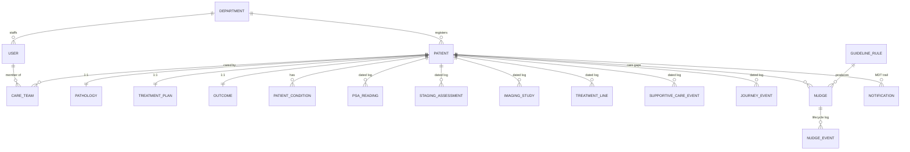

### 1.6 Do we need a Visit / Encounter concept? (design decision)

**Short answer: not as a *mandatory container* in v1 — but an *optional* Encounter is worth adding as a context layer.** ProstaCare is a **registry**, so it is organised by **clinical event date** (each PSA, staging, imaging, treatment line, supportive-care entry carries its own date). That is lower-burden than a full EMR and is exactly what the care-gap engine and cohort analytics need. Forcing every entry inside a visit would add data-entry friction and doesn't help the current-state or rules logic.

**What still needs "visit timing":** the Patient List segments (Last Visit / Upcoming / Missed-Overdue). These can be driven **today, without a full Encounter entity**, from existing date fields — `last_follow_up_date` (Outcome) and `next_follow_up_psa_date` (Supportive-care):
```
visit_status(patient):
   IF next_follow_up_psa_date in future        → "Upcoming"
   ELSE IF next_follow_up_psa_date in past      → "Missed / Overdue"
   ELSE                                         → "Last Visit" (use last_follow_up_date)
```

**Two models to choose between:**
| Model | What it means | When to pick |
|---|---|---|
| **Registry-by-event** (recommended v1) | Every clinical fact keyed by its own date; **no mandatory encounter**; visit-timing from follow-up-date fields | Registry + care-gap + analytics use case (this product) |
| **EMR-by-encounter** | Every entry tied to a visit/encounter; richer visit grouping | Only if the product must reflect exact visit boundaries, scheduling, or billing |

**Recommended (hybrid, low-cost):** add an **optional `Encounter`** — `encounter_id`, `encounter_date`, `type` (OPD / review / procedure / MDT), `clinician` — and a **nullable `encounter_id`** on each dated event. Events may reference an encounter (to group "everything done at the 2026-06-15 visit") but are **not required** to (registry backfill has no clean visits). Turn it on per-site when visit grouping or HIS-appointment sync is needed. This maps cleanly to the platform's appointment/encounter model later without reworking the event tiers.

> **Sign-off question (added to §7):** confirm registry-by-event for v1 with an optional Encounter, or require encounter-bound entry.

---

## 2. The one core idea — "current state" is computed from history

Everything the header shows ("current stage," "current line," "current castration status") is **the latest dated row**, not a stored cell. This is the single most important design rule, so a worked example:

```
STAGING history for PCR-001:
  Row A  assessed_on = 2026-01-10   risk = High             castration = HSPC
  Row B  assessed_on = 2026-06-15   risk = Very High        castration = HSPC

CURRENT STAGE  = latest row by assessed_on  = Row B (Very High, HSPC)
→ Header badge shows "Very High · HSPC"
→ Care-gap engine reads risk = Very High   (Row B), not High (Row A)
→ When the patient later progresses, a Row C (castration = CRPC) is ADDED,
  never overwriting Row B — so the HSPC→CRPC transition date is preserved.
```

Pseudo-code used everywhere current-state is needed:
```
FUNCTION current(model, patient):
    RETURN newest row in `model` WHERE patient_code = patient  ORDER BY <date> DESC  LIMIT 1
```

---

## 3. Workflows — inputs, logic, outputs (pseudo-code + visuals)

Each workflow states: **Trigger → Inputs → Logic (pseudo-code) → Outputs → Derived data touched.**

### W1 · Patient onboarding
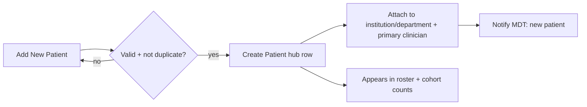
```
TRIGGER: user submits Add-New-Patient
INPUTS : patient_code, age_at_diagnosis, coverage, state, referral_source,
         department_id, primary_clinician_id            // institution = the tenant (implicit)
LOGIC  :
  IF patient_code already exists within this tenant → reject "duplicate code"
  ELSE create Patient(hub) with inputs; set registry_enrolment_date = today
       create empty Pathology, Treatment_plan shells
       route MDT new-patient notification (see W7)
OUTPUT : new Patient visible in roster; cohort counts +1
DERIVED: registrations-this-month, cohort volume recompute
```

### W2 · Clinical workup & staging
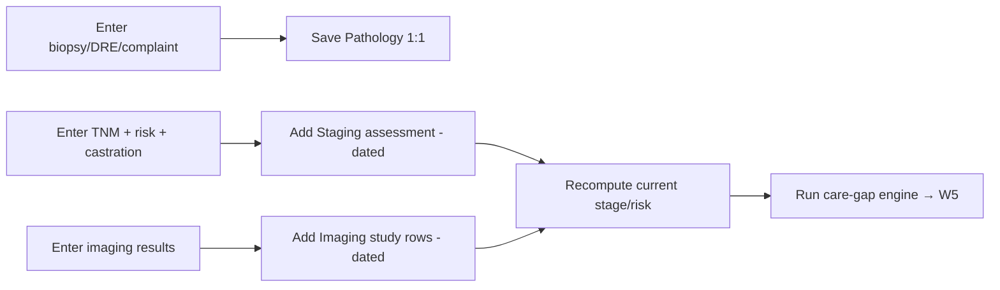
```
TRIGGER: clinician saves clinical assessment
INPUTS : pathology fields; staging fields (assessed_on defaults today);
         imaging modality+result rows
LOGIC  :
  Save Pathology (1:1, upsert)
  APPEND Staging_assessment row (never overwrite)
  FOR EACH imaging modality entered → APPEND Imaging_study row
  current_risk       = current(Staging, patient).eau_risk_category
  current_castration = current(Staging, patient).castration_status
  imaging_status(m)  = current(Imaging WHERE modality=m, patient).result  (else "Not done")
OUTPUT : updated current-state; header badges refresh
DERIVED: triggers W5 (care-gap re-evaluation)
```

### W3 · PSA capture & trend
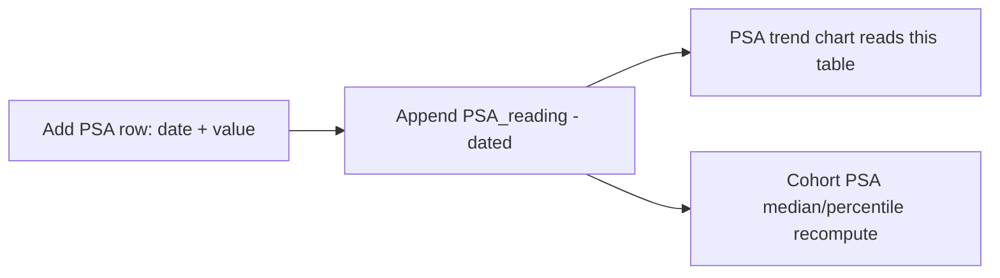
```
TRIGGER: clinician adds a PSA entry
INPUTS : psa_date, psa_ng_ml, free_psa_pct?, psa_density?
LOGIC  : APPEND PSA_reading row (dated)
         latest_psa = current(PSA_reading, patient).psa_ng_ml
OUTPUT : patient trend chart (bound to PSA_reading, not hardcoded points)
DERIVED: cohort PSA median, percentile bands, diagnostic-PSA distribution
```

### W4 · Treatment planning & lines
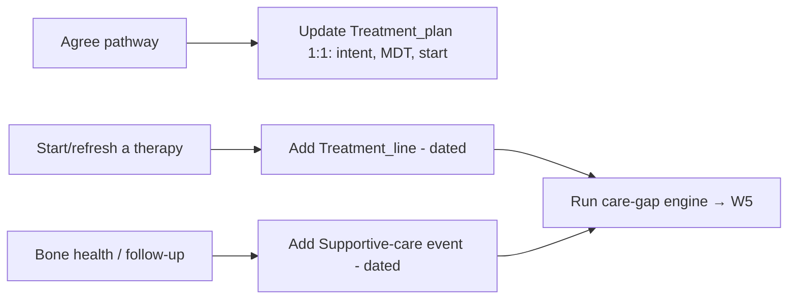
```
TRIGGER: team records/updates treatment
INPUTS : plan header (intent, mdt_status, mdt_date, treatment_start_date);
         one Treatment_line (line_type, agent, start_date, status, +RT/CGHS fields);
         one Supportive_care_event (bone_protection, dexa follow-up, phq9, follow-up PSA date)
LOGIC  : upsert Treatment_plan; APPEND Treatment_line; APPEND Supportive_care_event
         current_arsi = current(Treatment_line WHERE line_type=ARSI).status (else "Not initiated")
         current_bone_protection = current(Supportive_care_event).bone_protection_therapy
OUTPUT : treatment state auditable; cohort treatment analytics update
DERIVED: ADT duration, time-to-treatment, CGHS delay, ARSI uptake → W5 + §5
```

### W5 · Care-gap (nudge) engine — the heart of the product
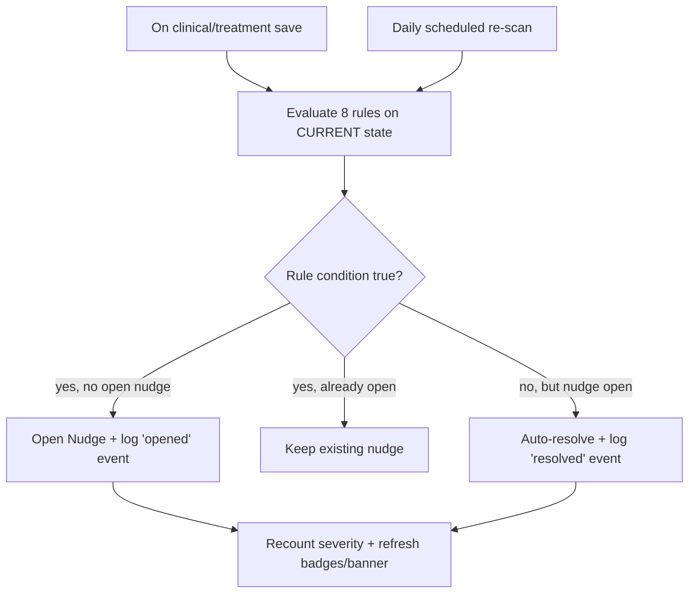
```
TRIGGER: (a) any staging/imaging/treatment/supportive save  (b) daily cron
INPUTS (current state per patient):
  risk = current(Staging).eau_risk_category
  castration = current(Staging).castration_status
  bone_scan  = imaging_status(bone_scan);   psma = imaging_status(psma_pet_ct)
  dexa = imaging_status(dexa);              germline = imaging_status(germline)
  bone_protection = current(Supportive).bone_protection_therapy
  arsi = current(Treatment_line WHERE ARSI).status
  next_follow_up_psa_date = current(Supportive).next_follow_up_psa_date
  phq9 = current(Supportive).phq9
LOGIC:
  FOR EACH rule IN guideline_rules(active):
     fired = evaluate(rule.condition, current_state)
     IF fired AND no open nudge with this rule_id:
         create Nudge(rule_id, severity, status=open); log Nudge_event(opened)
     IF (NOT fired) AND open nudge with this rule_id exists:
         set nudge.status = resolved; log Nudge_event(resolved)   // auto-resolve
OUTPUT: the patient's live nudge list (severity-coded, explainable)
DERIVED: urgent/warning/info counts, highest severity, primary focus,
         cohort gap counts, protocol score, nudge-trend (from Nudge_event)
NOTE  : "Acknowledge" (W6) does NOT resolve a nudge — only a changed source field does.
```

### W6 · Nudge lifecycle (acknowledge → route → resolve)
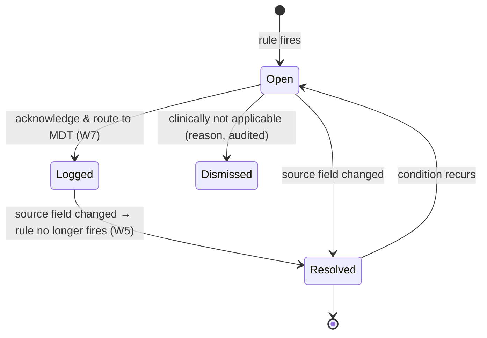
```
TRIGGER: clinician clicks Acknowledge & log on a nudge
INPUTS : nudge_id, actor
LOGIC  : log Nudge_event(acknowledged); open Team modal prefilled (W7)
         (status stays 'open'/'logged' — resolution is data-driven, not a click)
OUTPUT : nudge shows "Logged with team"; discussion trail entry
DERIVED: nudge-trend "acted" count increments
```

### W7 · MDT notify & discussion
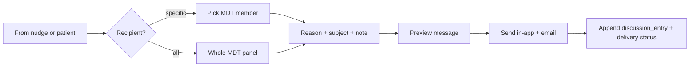
```
TRIGGER: acknowledge-from-nudge (W6) OR "Discuss with Team"
INPUTS : recipient_mode, recipient(s), reason, subject, note, patient_code
LOGIC  : resolve recipients (member OR mdt_panel of department)
         create Notification(reason, body, recipients); send via channel(s)
         APPEND discussion_entry to patient trail; record delivery status
OUTPUT : MDT informed; per-patient discussion log updated; toast
DERIVED: MDT-review-rate, collaboration audit
```

### W8 · Cohort analytics (derivation)
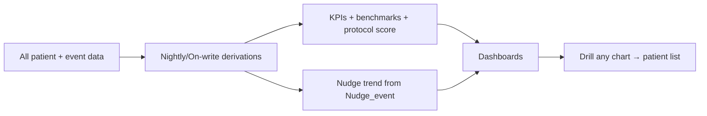
```
TRIGGER: on-write + scheduled refresh
INPUTS : every model in §1
LOGIC  : compute derived metrics (§5) as views; apply de-identification for
         non-clinical/sponsor roles
OUTPUT : Home + Population dashboards; every widget drillable to patient_code
DERIVED: see §5 (all of it)
```

### W9 · AI Buddy (governed, stepwise)
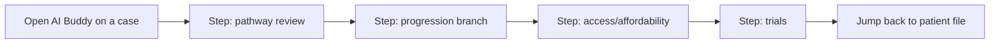
```
TRIGGER: user opens AI Buddy
INPUTS : structured record (read-only) + approved evidence/guideline packs
         + access-rule config
LOGIC  : stepwise review bounded to configured brain; NO free generation,
         NO inventing gaps, NO autonomous decisions, NO unlisted drug access
OUTPUT : explainable, step-by-step next-path view; links back to the file
DERIVED: none (read-only); every step audited
```

---

## 4. The 8 care-gap rules (full) + worked example

Inputs are always **current state** (latest dated rows). Each rule = one `guideline_rule` config row (versioned, clinically signed-off).

| # | rule_id | Condition | Severity | Next step (shown to user) |
|---|---|---|---|---|
| 1 | `bone_scan_missing` | `bone_scan = Not done` AND risk ∈ {High, Very High, M1} | **Urgent** | Complete bone scan / SPECT |
| 2 | `psma_missing` | `psma = Not done` AND risk ∈ {High, Very High} | **Urgent** | Complete PSMA PET-CT |
| 3 | `bone_protection_missing` | `bone_protection = Not started` | **Urgent** | Start bone protection plan |
| 4 | `dexa_missing` | `dexa = Not done` | **Warning** | Order DEXA baseline |
| 5 | `genomics_missing` | `germline = Not done` | **Warning** | Order germline/somatic testing |
| 6 | `arsi_readiness` | `castration = HSPC` AND risk ⊇ High AND `arsi = Not initiated` | **Warning** | Review ARSI intensification |
| 7 | `followup_psa_missing` | `next_follow_up_psa_date` is empty | **Info** | Schedule follow-up PSA |
| 8 | `psychosocial_prompt` | `phq9` blank or "Not done" | **Info** | Complete PHQ-9 screening |

**Worked example — patient `PCR-001`** (values from the workbook sample):
```
CURRENT STATE:
  risk = High         castration = HSPC
  bone_scan = Not done   psma = Not done   bone_protection = Not started
  dexa = Not done        germline = Not done   arsi = Not initiated
  next_follow_up_psa_date = 2026-07-18 (present)   phq9 = Not done

EVALUATE:
  1 bone_scan_missing      → Not done AND High           → FIRES  (Urgent)
  2 psma_missing           → Not done AND High           → FIRES  (Urgent)
  3 bone_protection_missing→ Not started                 → FIRES  (Urgent)
  4 dexa_missing           → Not done                    → FIRES  (Warning)
  5 genomics_missing       → Not done                    → FIRES  (Warning)
  6 arsi_readiness         → HSPC AND High AND Not init   → FIRES  (Warning)
  7 followup_psa_missing   → date present                → does not fire
  8 psychosocial_prompt    → phq9 = Not done             → FIRES  (Info)

RESULT: 7 open nudges → Urgent 3 · Warning 3 · Info 1
        Highest severity = Urgent ; Primary focus = "Complete bone scan / SPECT"
        Header banner = "Urgent: 3 actions require attention"

LATER: clinician records bone_scan = "Done — no metastases" and saves.
  → W5 re-runs → rule 1 no longer fires → nudge #1 AUTO-RESOLVES
  → counts become Urgent 2 · Warning 3 · Info 1 (no manual "close" needed).
```

---

## 5. Derived data — every computed number + its formula

Nothing here is typed; all is computed from §1 (pseudo-code).

| Derived value | Formula (pseudo-code) | Feeds |
|---|---|---|
| current_stage / risk / castration | `current(Staging).<field>` | Header badges, rule inputs |
| latest_psa | `current(PSA_reading).psa_ng_ml` | Header, cohort median |
| ADT duration | `today − current(Treatment_line WHERE ADT).start_date` | Treatment dashboard, bone-gap logic |
| time-to-treatment | `treatment_start_date − diagnosis_date` | Access/delay analytics |
| CGHS delay | `(cghs_approval_date OR today) − cghs_request_date` | Access analytics |
| gap counts | `COUNT(Nudge WHERE status=open GROUP BY severity)` | Home KPIs, banner |
| protocol score | `weighted % of rule-families passing across cohort` | Home + Quality dashboard |
| record completeness | `% required fields present per field-group` | Home, incomplete-records list |
| benchmark deltas | `cohort % vs NCCN target` for ARSI/PSMA/bone/MDT | Benchmark cards |
| nudge trend | `COUNT(Nudge_event GROUP BY action, period)` | Nudge-trend chart |
| KM survival | `survival(risk_group, recurrence dates)` | Outcomes dashboard |
| registrations/month | `COUNT(Patient GROUP BY month(registry_enrolment_date))` | Home + Overview |

**Access rule on all derived data:** clinical roles see identified/in-scope; **ops/quality/sponsor see de-identified aggregate only** (masked drill rows).

---

## 6. Visual master flow (end-to-end)
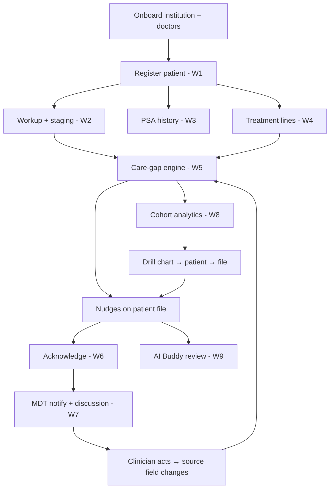

---

## 7. Sign-off checklist (for the clinical team)

Please confirm, amend, or reject each:
1. **Data models (§1)** — are the variables per model complete and correctly named for clinical use? Any field missing (e.g. additional comorbidity, biomarker, toxicity grade)?
2. **Current-state rule (§2)** — agreed that "current stage/line/castration" = latest dated entry, and that restaging/progression is a **new** row (never an overwrite)?
3. **Cardinality calls** — `Pathology` and `Outcome` as 1-per-patient (re-biopsy → new row); `Supportive-care` as a **dated** log (bone-protection audit) — agreed?
4. **The 8 rules (§4)** — conditions, severities, and next-step wording clinically correct? Any rule to add/remove/retune (e.g. thresholds, risk sets)?
5. **Auto-resolve semantic (§3 W5/W6)** — agreed that acknowledging routes to MDT but only a changed source field resolves a nudge?
6. **Derived metrics (§5)** — formulas acceptable; benchmark targets (ARSI 60%, PSMA 85%, bone 85%, MDT 95%) confirmed by clinical governance?
7. **Governance** — who signs off the rule pack + evidence packs (independent of any sponsor)?
8. **Identity model** — de-identified registry (recommended) vs identified — confirm (drives everything downstream).
9. **Visit / Encounter (§1.6)** — confirm **registry-by-event with an optional Encounter** for v1 (recommended), or require every entry to be encounter-bound.
10. **Tenancy** — confirmed **tenant = institution** (no `institution_id`); cross-institution reporting via a de-identified aggregation layer — agreed?

Once §7 is signed, this spec becomes the build contract; engineering maps it to the platform per `PROSTACARE_BUILD_SPEC_V1.md` / `NOVA-EDGE-FEASIBILITY.md`.

---

*Companion docs: `PROSTACARE_BUILD_SPEC_V1.md` (platform/NOVA Edge mapping), `FLOW-CLARITY-AND-OPEN-QUESTIONS.md` (decisions & open questions), `ProstaCare_Nudge_Logic_Handoff.md` (source of the 8 rules), and the `ProstaCare_Schema_08072026_V2.xlsx` workbook (authoritative field dictionary + value lists).*
