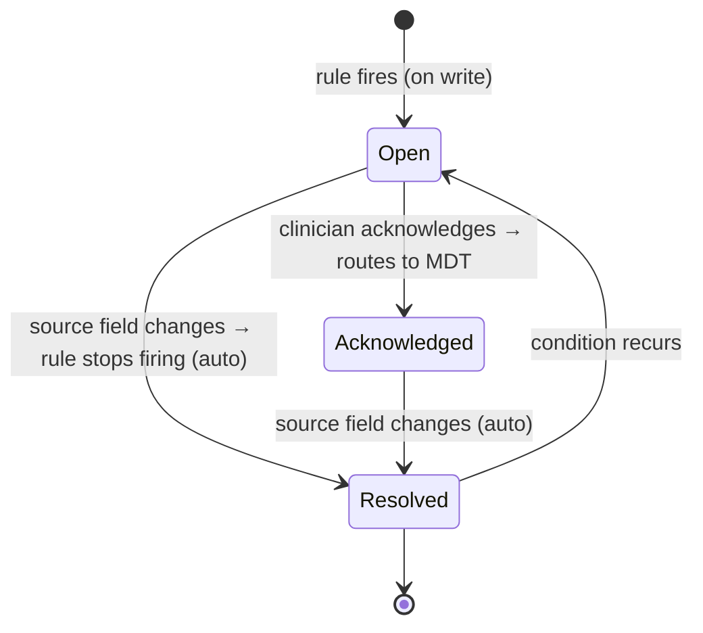

# ProstaCare — Simplification Review (are we over-building?)

**Method:** every construct we have specified, cross-checked against what the requirements actually ask for — `FUNCTIONAL_REQUIREMENTS.md` (with its Must / Should / **Future** priorities), `PRD.md`, `SCOPE.md`, `ProstaCare_Nudge_Logic_Handoff.md`, and the V2 workbook. If nothing requires it, it is a candidate to cut or defer.

**Headline:** we were over-building in **13 places**. Cutting them removes ~1 entity, ~1 background job, 2 nudge states, a partition scheme, an import transform, and a whole AI subsystem from v1 — with **no loss against any stated requirement**.

---

## 1. Evidence from the requirement docs

| Check | Result |
|---|---|
| "AI Buddy" in FR / PRD / SCOPE | **0 mentions** (exists only in the newer workbook) |
| "snooze" / "SLA" / "escalation" / "encounter" in FR / Nudge Handoff | **0 mentions** |
| FR items explicitly marked **Future** | production auth, cross-device persistence, **rules governance**, real email/messaging, secure doc storage, guideline content governance, audit logs, encryption |
| Nudge lifecycle in the Handoff | open → (acknowledge routes to team) → **auto-resolves when the source field changes**. No dismiss, no snooze. |

---

## 2. The 13 trims

| # | We specified | Required by? | Verdict | Simpler path |
|---|---|---|---|---|
| **T1** | **Nudge `snooze`** | Nothing | ❌ **Cut** | Not in demo, FR, or Handoff. Drop entirely. |
| **T2** | **Nudge `dismissed` state** | Nothing | ❌ **Cut** | Clinical non-applicability is **already expressed in the data**: `bone_protection = "Not indicated"`, `mdt_status = "Not applicable"`, `germline = "Pending"`. The rules simply don't fire. No dismiss action needed. *(Cheap to add later if clinicians ask.)* |
| **T3** | **SLA / escalation** for unactioned urgent nudges | Nothing | ⏸ **Defer** | No requirement. Add when clinicians ask for it. |
| **T4** | **`encounter` entity** (even optional) | Nothing | ⏸ **Defer** | Visit timing already comes from `next_follow_up_psa_date` + `last_follow_up_date`. Don't build it in v1; document as future (HIS appointment sync). |
| **T5** | **Table partitioning** on `psa_reading` / `nudge_event` | Nothing | ❌ **Cut** | At ~347 patients / a few thousand rows this is pure overhead — and it forces a composite PK + a lookback gotcha. Plain indexed tables. Revisit at 6-figure volumes. |
| **T6** | **`patient_condition`** normalized table (+ import transform) | Nothing | ❌ **Cut** | The workbook and the UI both use **Yes/No flag columns** (9 comorbidities, 6 family-history). Keep them as boolean columns. Removes an entity **and** gap **G6** (the pivot transform). The list is fixed; the comorbidity/pair charts are trivial SQL over booleans. |
| **T7** | **`mdt_panel` / `mdt_panel_member` table** | Nothing | ❌ **Cut** | Since MDT is only a *notification group* (no access implication), make it a boolean **`user.is_mdt_member`**. One less table and join. |
| **T8** | **5 roles** (Clinician, HOD, Coordinator, Ops/Quality, Admin) | FR implies few | ✂️ **Trim to 3** | **Clinician · HOD (privileged) · Admin.** Coordinator = a Clinician. Add **Ops/Quality** only if in-product de-identified dashboards are needed (sponsor reads Data Cloud anyway). |
| **T9** | Care-gap engine on **write-subscriptions *and* a daily cron** | Nothing | ✂️ **Trim** | All 8 rules are **state-based, not time-based** — they only change when data changes. **On-write is sufficient.** Add the cron only when a time-based rule appears (e.g. "DEXA older than 2 years"). |
| **T10** | `nudge_event` actions: opened / **viewed** / acted / **routed** / resolved | FR-022 (Should) | ✂️ **Trim to 3** | Keep **opened · acknowledged · resolved** (enough for the trend chart and audit). "Viewed" is per-user telemetry; "routed" is inferable from the `notification` row. |
| **T11** | Notifications: in-app inbox **+ SES email + live SSE push + task creation + digest** | FR-070..075 (Must/Should), FR-076 (Future) | ✂️ **Trim** | v1 = **SES email + a simple in-app notification list**. Drop live SSE push, auto-task creation, and the digest scheduler. |
| **T12** | **AI Buddy** (ADK agent, 4 lenses, `evidence_pack` / `guideline_pack`) | **0 mentions in FR/PRD/SCOPE** | ⏸ **Defer to Phase 2** | The largest single build in the spec, required by nothing in the agreed requirements. Ship the registry + care-gap engine + dashboards first. |
| **T13** | **Rule-builder UI + versioned sign-off workflow** | FR-064 = **Future** | ✂️ **Trim** | Seed the 8 rules as config (`guideline_rule`: rule_id, severity, next_step, active, version). Edit via admin/JSON. **No rule-editor UI in v1.** |

---

## 3. What we keep (and why)

| Kept | Justification |
|---|---|
| **Dated `staging_assessment`** | Restaging + HSPC→CRPC drives the ARSI rule. Overwriting loses the transition. Non-negotiable. |
| **Dated `treatment_line`** | Therapy is sequential (ADT → ARSI → chemo → RT). One row can't express it. |
| **Dated `imaging_study`** | Same shape as `psa_reading`; gives study dates the monthly sponsor metrics need. Cheap. |
| **Dated `supportive_care_event`** | Bone protection is the largest care gap; start/stop needs an audit trail. |
| **`nudge` + `nudge_event`** | The trend chart (FR-022) and closure audit are impossible from snapshot rows — the workbook says so itself. |
| **Record lock + HOD unlock** | Explicitly requested. Kept as **one** mechanism (no separate amendment/void concept). |
| **`sponsor_metric` + Data Cloud** | Explicitly requested; the only cross-tenant path. |
| **4 × 1:1 tables** (patient, pathology, treatment_plan, outcome) | They map 1:1 to the four entry screens and to the **completeness-by-field-group** requirement. Not folded into one wide table. |

---

## 4. The simplified v1 model

**Entities (down from ~22 to ~15):**
```
Config/users : app_user (role, email, is_mdt_member) · guideline_rule
1:1 per pt   : patient · pathology (+comorbidity/family flags) · treatment_plan · outcome
1:N dated    : psa_reading · staging_assessment · imaging_study ·
               treatment_line · supportive_care_event · journey_event
System       : nudge · nudge_event · notification/discussion_entry · document · audit_event
Derived      : current_state · dashboards · sponsor_metric
```
**Removed from v1:** `department`, `care_team_member`, `mdt_panel`, `patient_condition`, `encounter`, `evidence_pack`, `guideline_pack`, partitioning, the daily cron, snooze, dismiss, SLA/escalation, SSE push, digest, rule-builder UI, AI Buddy.

**Simplified nudge lifecycle:**

*(No Dismissed. No Snoozed. Resolution is data-driven — exactly what the Nudge Handoff describes.)*

---

## 5. Impact

| Benefit | Detail |
|---|---|
| **Fewer moving parts** | −7 entities, −1 background job, −2 nudge states, −1 partition scheme, −1 import transform |
| **Gaps closed for free** | **G5** (partition PK/lookback) and **G6** (flag→row transform) disappear entirely |
| **Smaller v1 scope** | AI Buddy (the biggest subsystem) moves to Phase 2 |
| **Fewer client questions** | T3/T4/T12 remove three items from the dev-start gate |
| **Nothing lost** | Every trim is unsupported by FR / PRD / SCOPE / Handoff |

---

## 6. Recommended phasing after the trim

| Phase | Scope |
|---|---|
| **P0** | Tenancy + roles (3) + patient hub + 1:1 entities + record lock |
| **P1** | Dated tiers (PSA, staging, imaging, treatment lines, supportive care, journey) |
| **P2** | Care-gap engine (8 rules, on-write) + nudge lifecycle + MDT notify (SES) |
| **P3** | Dashboards + `sponsor_metric` + Data Cloud pipeline |
| **P4** | *(later)* AI Buddy, encounter/HIS sync, SLA/escalation, rule-editor UI, partitioning |

---

## 7. Ask the client to confirm the cuts
1. **Nudge lifecycle** = open → acknowledged → auto-resolve. **No snooze, no dismiss** — non-applicability is captured in the field value ("Not indicated" / "Not applicable"). OK?
2. **AI Buddy deferred to Phase 2** (absent from the agreed functional requirements). OK?
3. **Roles = Clinician · HOD · Admin** (Coordinator folded into Clinician). OK?
4. **No SLA/escalation, no encounter** in v1. OK?
5. Comorbidity/family history stay as **Yes/No flags** (as in the workbook/UI). OK?

---

*Cross-checked against: `FUNCTIONAL_REQUIREMENTS.md` (Must/Should/Future), `PRD.md`, `SCOPE.md`, `ProstaCare_Nudge_Logic_Handoff.md`, `ProstaCare_Schema_08072026_V2.xlsx`.*
