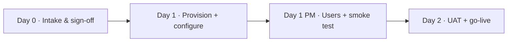

# ProstaCare — Tenant Onboarding Plan (Institution Provisioning)

**Purpose:** define how a new **institution** (= one tenant) is onboarded from a **golden preset blueprint** of schemas, workflows, rules, dashboards, and roles — so each hospital goes live in **1–2 days** with **config + user setup only, no code**.

**Model recap:** tenant = institution (one Postgres schema per hospital). Everything clinical is identical across institutions (the golden preset); only institution-specific config and the user roster vary. Cross-institution reporting flows through Zygo Data Cloud (`CROSS_TENANT_AGGREGATION_SPEC.md`).

---

## 1. The golden preset blueprint — identical for every institution

`presets/prostate_cancer/` is provisioned as-is into each new tenant. It contains:

| Preset file | What it seeds (same for all institutions) |
|---|---|
| `schemas.json` | All entities (Tier 0/1/2/3) — patient hub, pathology, staging_assessment, imaging_study, treatment_line, supportive_care_event, psa_reading (partitioned), outcome, journey_event, nudge + nudge_event, notification/discussion, document, guideline_rule, evidence_pack, department/app_user/role/care_team/mdt_panel, `sponsor_metric` |
| `workflows.json` | Care-gap engine (8 rules), MDT notify, patient onboarding, outcome derivations, **nightly `sponsor_metric` aggregation** |
| `guideline_rule` seed | The 8 versioned, signed-off care-gap rules |
| `mat_views.json` | Current-state projections + Home/Population dashboards + de-identified sponsor views |
| `pages.json` + `ui/schema_ui.json` | Home, Patient List, Patient File (detail), Population Dashboard, Admin console |
| `agents.json` + `evidence_pack` | AI Buddy (bounded) + evidence/guideline packs |
| `roles.json` | HOD, Treating Clinician, MDT Member, Coordinator, Ops/Quality, Admin + scopes |
| `Value_Lists` / enums | All dropdown option sets (from the workbook) |
| `app_theme.json` | ProstaCare palette (Visual Language) |

**Key point:** because the clinical logic, rules, dashboards, and AI are all in the blueprint, per-institution onboarding never touches schemas or workflows — it is **configuration + users only**.

---

## 2. What varies per institution (the intake)

Collected **before** provisioning (intake form):

| Item | Example | Used for |
|---|---|---|
| Institution profile | name, city, state, logo | `config.json`, theme (optional) |
| `institution_code` (anonymised) | `INST-017` | cross-tenant aggregation |
| Department(s) | "Urology & Radiation Oncology" | scope boundary |
| **User roster** | doctors/coordinators/ops: name, specialty, role, email | `app_user` + role + scope |
| MDT panel members | subset of the roster | "notify all MDT" target |
| Identity source | Azure AD SSO **or** platform-local accounts | auth setup |
| Facility/enum overrides | local RT facilities, referring centres | dropdown localisation (optional) |
| Governance sign-offs | identity model (de-identified vs identified), rule-pack version, aggregation contract | go-live gate |
| Data load | start empty vs seed/migrate existing registry | initial cohort |

---

## 3. Onboarding runbook — 1–2 days



### Day 0 (pre-work, async) — Intake & sign-off
- Collect the §2 intake form; confirm governance sign-offs (identity model, rule pack, aggregation contract, suppression threshold).
- Assign `institution_code`; confirm SSO details or local-account plan.
- **Gate:** intake complete + sign-offs in hand.

### Day 1 AM — Provision the tenant
1. `POST /bootstrap/system` → create the institution's tenant (schema, canonical entities, roles).
2. Seed the golden preset: `seed-preset.py prostate_cancer` → all entities, workflows, rules, mat-views, dashboards, AI Buddy, theme.
3. Configure institution: `config.json` (name/branding), `institution_code`, department(s), facility/enum overrides.
4. Wire aggregation: enable the nightly `sponsor_metric` job + S3 export prefix for this tenant.
5. Configure auth: Azure AD SSO **or** local accounts.
- **Gate:** tenant up; preset seeded; login works.

### Day 1 PM — Users & smoke test
6. Onboard `app_user` roster → assign role + department scope + MDT-panel membership.
7. Load initial data (empty, or seed/migrate existing registry).
8. **Smoke test the golden path:** create a patient → enter staging/imaging/treatment → **8 nudges fire correctly** → acknowledge → **MDT notify** delivers → **dashboards populate** → **`sponsor_metric` row computes** (de-identified, suppressed).
- **Gate:** end-to-end path green.

### Day 2 — UAT & go-live
9. Walkthrough with the clinical lead + coordinator (roster review, scopes, nudges, MDT flow, dashboards, AI Buddy boundary).
10. Fix any config/roster tweaks; confirm access boundaries (department-scoped; ops/sponsor de-identified).
11. Confirm first aggregation export reaches Zygo Data Cloud.
12. **Go-live**; handover admin console + support contact.
- **Gate:** clinical sign-off → live.

> Institutions with **existing data to migrate** or **custom SSO** may extend into a 2nd day; a greenfield single-department site can complete in **~1 day**.

---

## 4. Onboarding checklist

```
INTAKE (Day 0)
  [ ] Institution profile + logo
  [ ] institution_code assigned
  [ ] Department(s) defined
  [ ] User roster (name/specialty/role/email)
  [ ] MDT panel members
  [ ] Identity source (SSO / local) confirmed
  [ ] Facility/enum overrides (if any)
  [ ] Governance sign-offs: identity model · rule pack · aggregation contract · suppression threshold

PROVISION (Day 1)
  [ ] Tenant bootstrapped
  [ ] Golden preset seeded (schemas/workflows/rules/mat-views/dashboards/AI)
  [ ] config.json + institution_code + departments + facilities set
  [ ] sponsor_metric nightly job + S3 export prefix enabled
  [ ] Auth (SSO/local) configured
  [ ] Users onboarded (role + scope + MDT panel)
  [ ] Initial data loaded (empty / seeded / migrated)

VERIFY (Day 1 PM – Day 2)
  [ ] Smoke test: patient → nudges (8 rules) → MDT notify → dashboards → sponsor_metric
  [ ] Access boundaries verified (department-scoped; de-identified for ops/sponsor)
  [ ] Clinical-lead UAT walkthrough
  [ ] First aggregation export reaches Zygo Data Cloud
  [ ] Go-live + admin handover
```

---

## 5. Why 1–2 days is realistic
- **No build per institution** — schemas, workflows, the 8 rules, dashboards, and AI Buddy are all in the golden preset; provisioning is a seed + config.
- **Config, not code** — institution profile, departments, facilities, users, scopes, and the aggregation hook are all JSON/console settings.
- **Repeatable & idempotent** — `bootstrap` + `seed-preset` are idempotent; the runbook is a checklist.
- **The only variable work** is the **user roster + SSO** and **optional data migration**, which is what can push a complex site toward the 2-day end.

---

## 6. Open decisions (`O-ONB`, extends `FLOW-CLARITY`)
1. **Provisioning owner** — platform team provisions tenants; institution admin manages users thereafter?
2. **Identity source per site** — Azure AD SSO vs platform-local (affects Day-1 auth step).
3. **Data migration** — greenfield vs import existing registry (affects timeline).
4. **Self-serve vs white-glove** — v1 is white-glove (admin-provisioned); self-serve is future (ties to `O-DEP`).
5. **Enum localisation** — keep the national value-lists as-is, or localise facilities/referring-centres per site.

---

*Companion: `PROSTACARE_BUILD_SPEC_V1.md` (preset contents + phasing), `CROSS_TENANT_AGGREGATION_SPEC.md` (the aggregation the onboarding wires up), `FLOW-CLARITY-AND-OPEN-QUESTIONS.md` (O-ONB decisions).*
