# ProstaCare India — Visual Workflows, User Stories & Feature Map

Visual companion to `PRODUCT-PRD.md`. Diagrams are written in **Mermaid** (renders on GitHub and most markdown viewers). Each major capability has: a user story, a visual flow, and acceptance criteria.

---

## 0. Product at a Glance — Capability Map

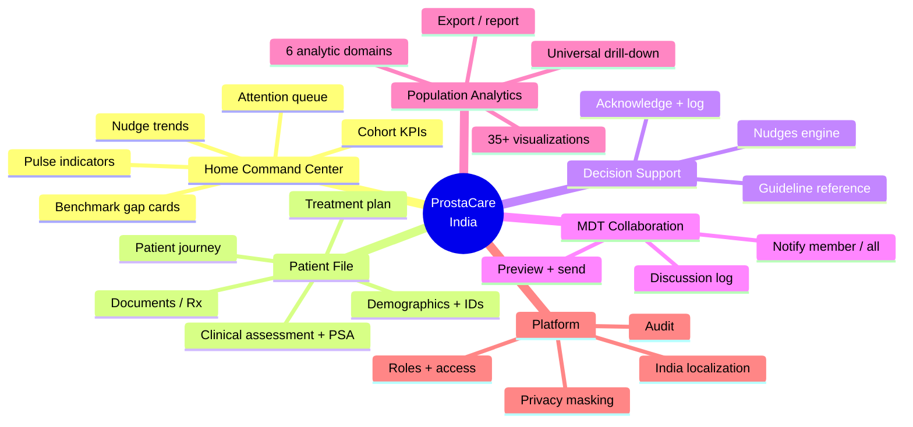

---

## 1. End-to-End Persona Journey (HOD)

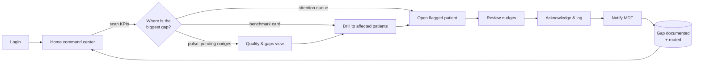

---

## 2. Core Value Loop — Gap → Nudge → Action → Closure

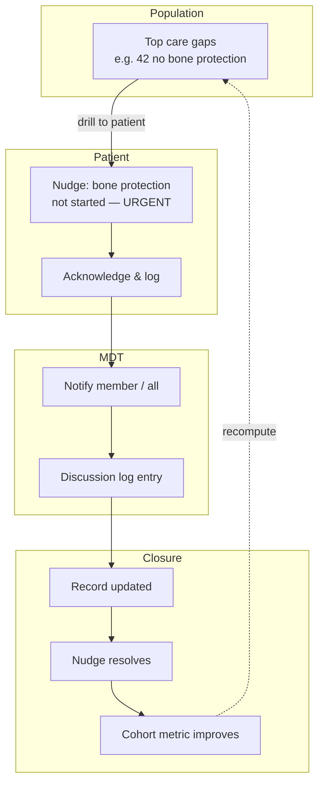

---

## 3. User Story Map (release-oriented)

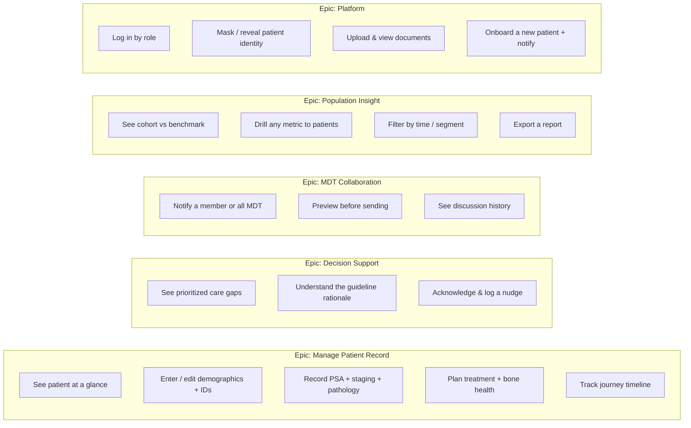

---

## 4. Feature Workflows (per capability)

### 4.1 Login & Role-Scoped Entry
**Story:** *As a clinician, I log in and land on a workspace scoped to my role so I only see patients I'm responsible for.*

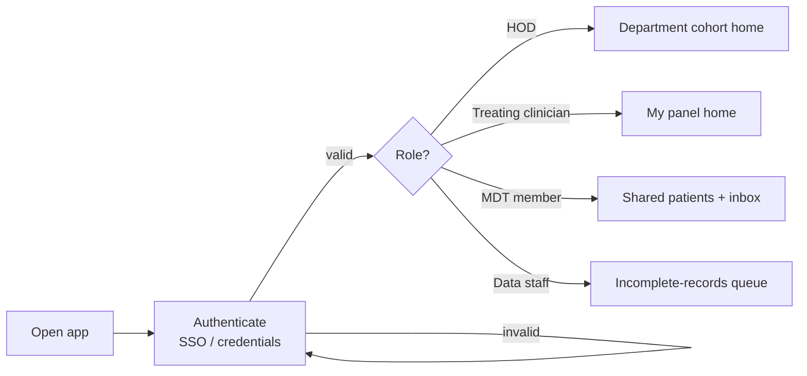
**Acceptance:** access scope enforced server-side · session + lockout · all entries audited.

---

### 4.2 Home → Navigate / Drill
**Story:** *As an HOD, I scan cohort health and jump straight to whatever needs attention.*

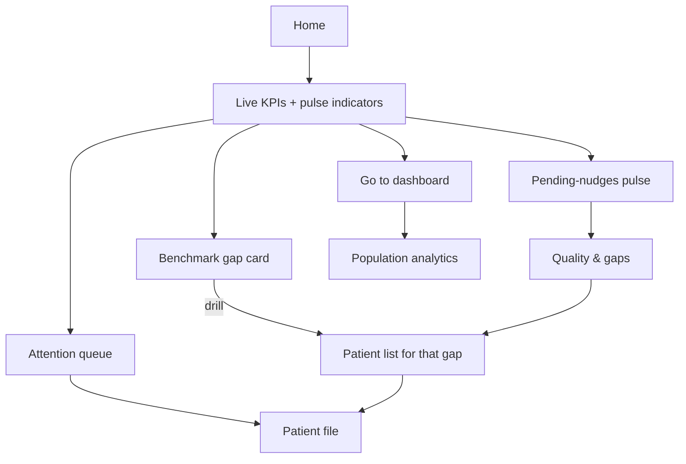
**Acceptance:** every KPI computed live · each metric drillable to named patients · state deep-linkable.

---

### 4.3 Patient File — Record & Edit
**Story:** *As a treating clinician, I view and complete a patient's record across demographics, clinical, treatment, and journey.*

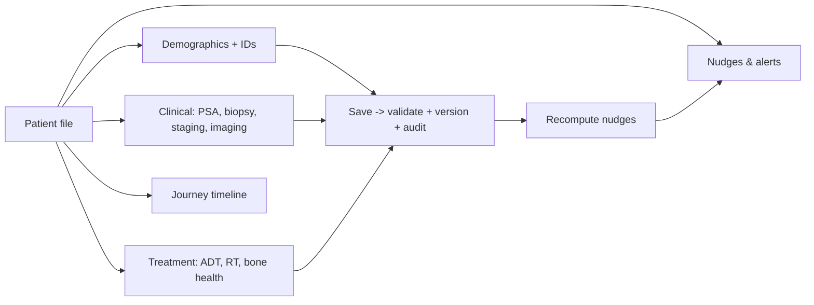
**Acceptance:** PSA chart is data-bound · saves persist with versioning · nudges recompute on change.

---

### 4.4 Nudges (Decision Support)
**Story:** *As a clinician, I see guideline-based care gaps for this patient, ranked by urgency, with the reason and how to act.*

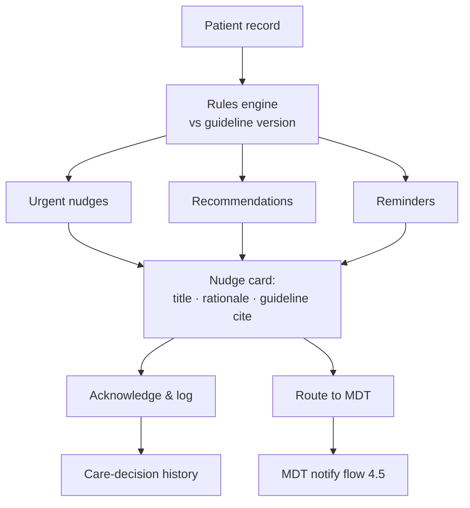
**Acceptance:** rules versioned & clinically validated · status open/logged/resolved · rolls up to cohort metrics.

---

### 4.5 MDT Notify & Discussion
**Story:** *As a clinician, I notify a colleague or the whole MDT about a patient, preview the message, send it, and keep a discussion trail.*

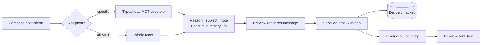
**Acceptance:** real delivery + status · summary links access-controlled & expiring · full audit.

---

### 4.6 Documents (Rx & Reports)
**Story:** *As staff, I attach prescriptions/reports to a patient and the team can view them.*

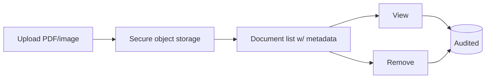
**Acceptance:** scoped access · uploads/views/removes audited.

---

### 4.7 New Patient Onboarding + Team Notify
**Story:** *As a clinician, I register a new patient and the MDT is automatically notified.*

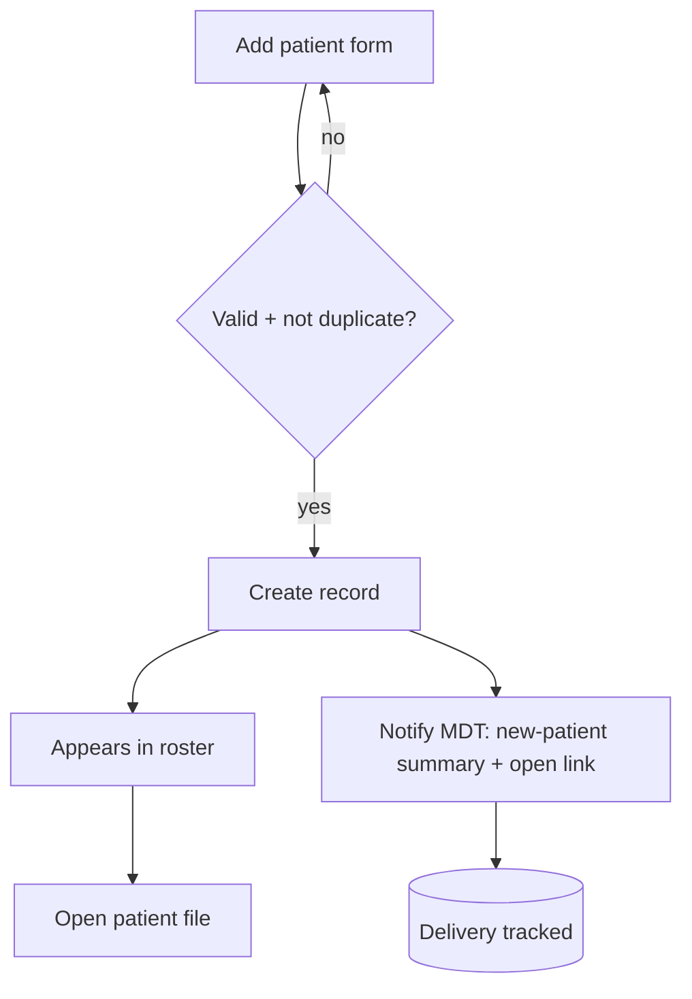
**Acceptance:** duplicate detection · notification reaches MDT with working link · immediate roster visibility.

---

### 4.8 Population Analytics + Drill-Down
**Story:** *As an HOD, I explore cohort metrics, compare to benchmarks, and drill any chart to the patients behind it.*

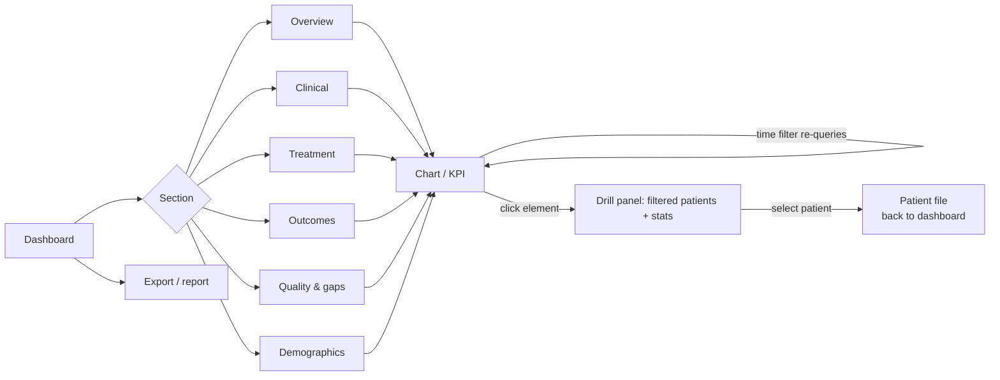
**Acceptance:** all metrics data-bound · time filters re-query · every chart drillable to patients · export works.

---

### 4.9 Privacy Masking (cross-cutting)
**Story:** *As a clinician, patient identities are masked by default and I reveal them deliberately.*

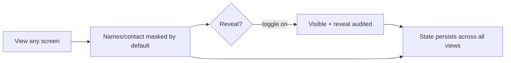
**Acceptance:** consistent across home/list/file/analytics · per-user persisted · reveal events audited.

---

## 5. Roles × Features (RACI-style matrix)

```mermaid
flowchart TB
    classDef ok fill:#1e9b61,color:#fff,stroke:#0a5;
```

| Feature | HOD | Treating clinician | MDT member | Data staff | Admin |
|---|:--:|:--:|:--:|:--:|:--:|
| Cohort home / analytics | ✅ full | ✅ own panel | 🔸 shared | — | ✅ |
| Patient record edit | ✅ | ✅ | 🔸 view/contribute | ✅ entry | ✅ |
| Nudges — act/log | ✅ | ✅ | 🔸 | — | ✅ |
| MDT notify / discuss | ✅ | ✅ | ✅ | — | ✅ |
| Documents upload/view | ✅ | ✅ | 🔸 view | ✅ | ✅ |
| New patient onboard | ✅ | ✅ | — | ✅ | ✅ |
| Reveal identity (audited) | ✅ | ✅ | 🔸 | 🔸 | ✅ |
| User / role / config | — | — | — | — | ✅ |

✅ full · 🔸 scoped/limited · — none

---

## 6. State Lifecycle — a Care Gap (Nudge)

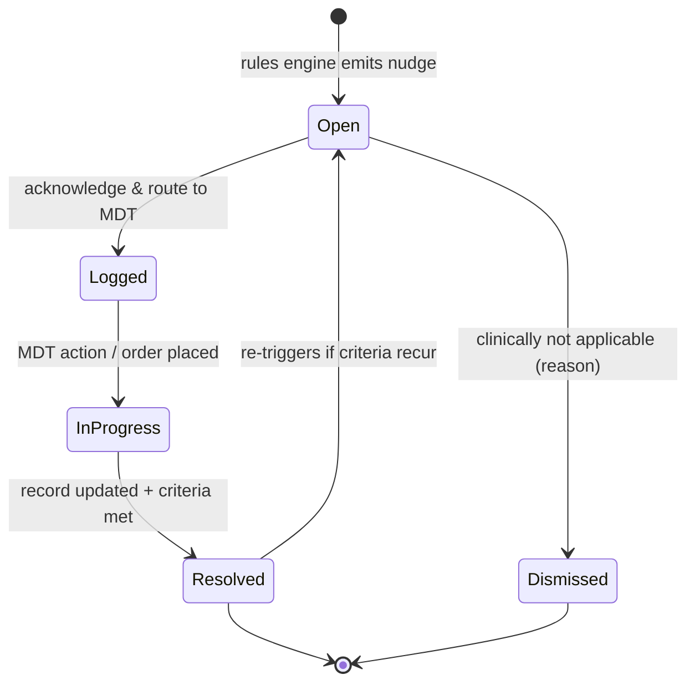

---

## 7. System Context (production target)

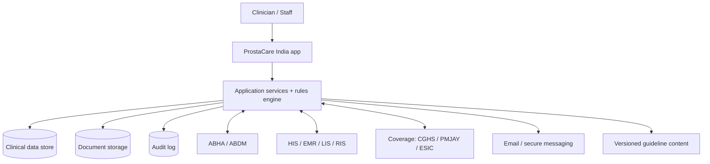

---

### Notes
- Diagrams describe the **intended product**, not the demo's iframe/localStorage implementation.
- Keep this file in sync with `PRODUCT-PRD.md` (requirements) and the as-built inventory in `FEATURE-PRD.md` / `FLOW-PRD.md`.
